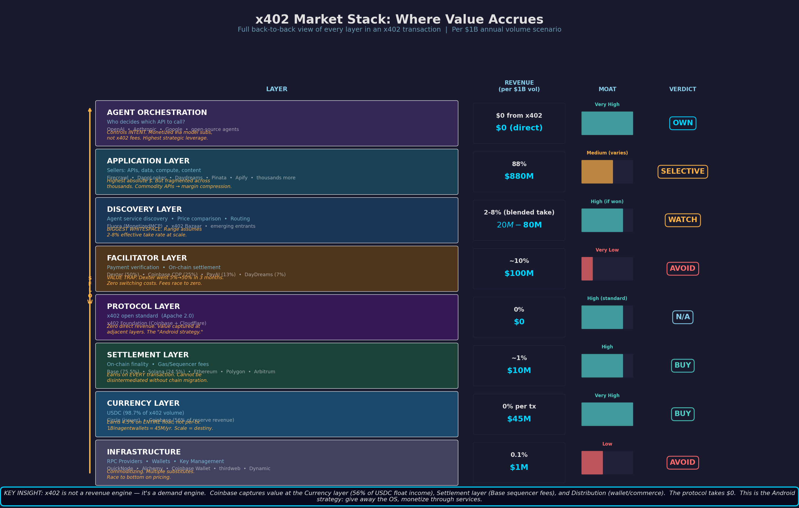

# Top-Level Takeaways (Start Here)

**Purpose:** This is the top-level memo for the repository. If you read one file first, read this one.
**Date:** February 2026 (updated with repo-wide synthesis)

## What Matters Most

1. The highest-conviction investment zone is **agent-fintech infrastructure**, especially identity, compliance, and orchestration layers.
2. **Protocol fragmentation is real** (x402, ACP, AP2, TAP, UCP, Agent Pay), creating a large need for cross-rail abstraction.
3. **B2B adoption is leading B2C** because enterprise workflows have clearer ROI and governance paths.
4. **Crypto and fiat rails are likely complementary**, not winner-take-all.
5. **Regulation is a moat**, not just a cost center.
6. **Facilitator-only payment models are vulnerable** without compliance/policy/workflow differentiation.
7. The strongest open whitespace remains **cross-protocol orchestration** and **agent service discovery**.
8. Data quality varies across the corpus; several headline metrics are directional and require diligence before hard underwriting.

## Visual Dashboard

## Start-Here Reading Path

1. [Investment Committee Memo](investment-committee-memo-agent-fintech-infrastructure-2026-02-09.md)
2. [Top 15 Investment Opportunities](investment-opportunities.md)
3. [Agent-Fintech Intersection Deep Dive](agent-fintech-intersection-deep-dive.md)
4. [Memo Index (Full Hierarchy)](README.md)

## Supporting Memos By Domain

1. [Fintech Market Analysis](fintech-market-analysis.md)
2. [Fintech Investment Opportunities 2026](fintech-investment-opportunities-2026.md)
3. [AI Agent Economy Memo](agent-economy-memo.md)
4. [x402 Protocol Research Memo](x402-research-memo.md)
5. [x402 Value Capture Analysis](x402-value-capture-analysis.md)
6. [Fintech x AI Agents Intersection](fintech-agents-intersection.md)

## Reference Appendices

1. [Agent-Fintech Market Map](../research/market-map.md)
2. [x402 Value Accrual Deep Dive](../x402-value-accrual-deep-dive.md)
