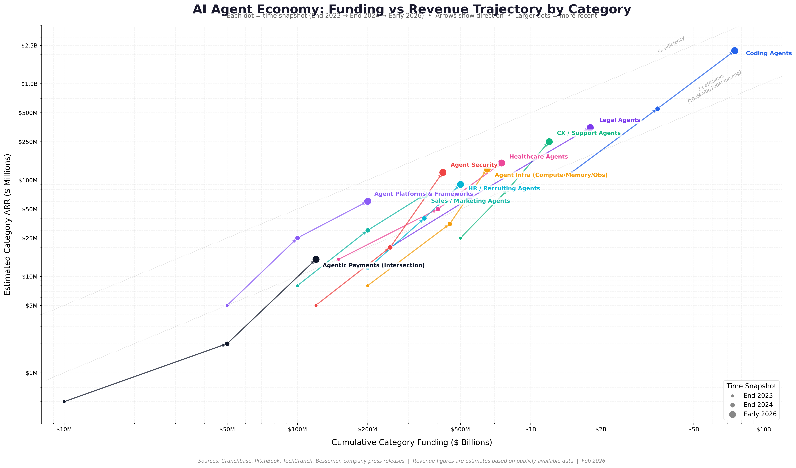
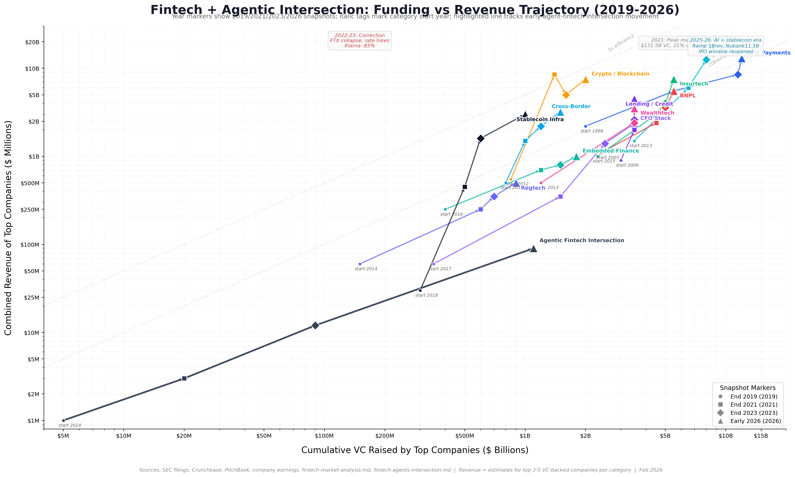
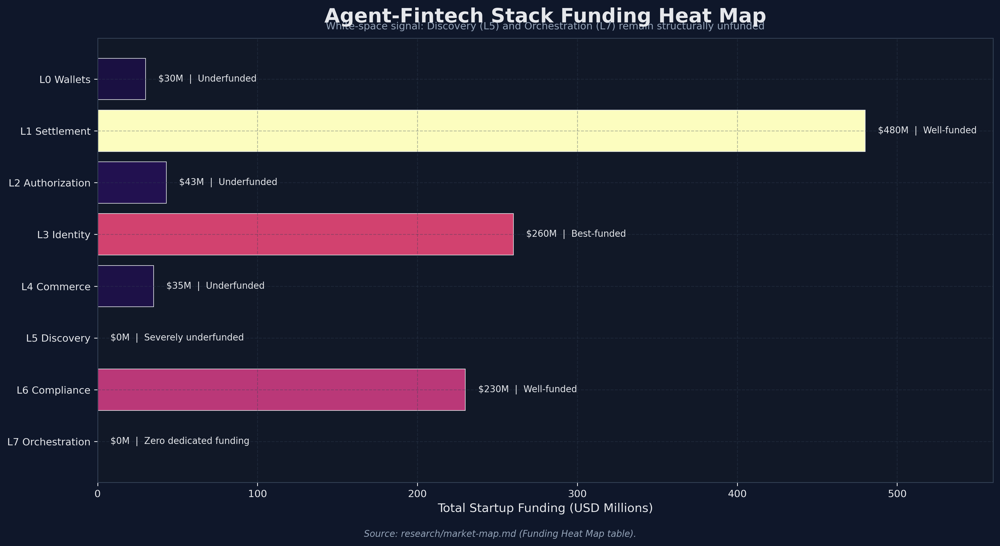
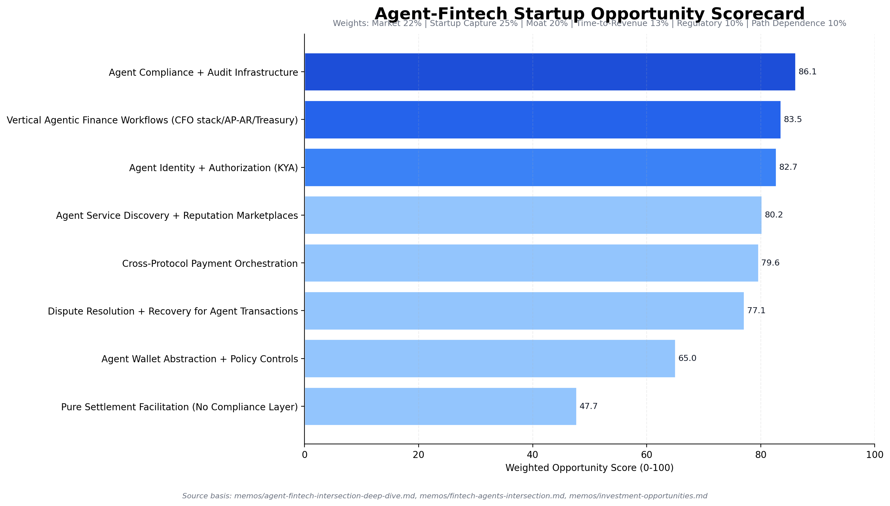

# Final Synthesis Memo: Agent Ecosystem, Fintech, and Startup Opportunities at the Intersection

**Date:** February 2026  
**Classification:** Final Strategy Memo (Repo Synthesis)

## Memo Navigation

- Start Here: [Top-Level Takeaways](00-top-level-takeaways.md)
- Full Hierarchy: [Memo Index](README.md)
- Decision Layer: [IC Memo](investment-committee-memo-agent-fintech-infrastructure-2026-02-09.md), [Top 15 Opportunities](investment-opportunities.md)
- Deep Dives: [Agent-Fintech Deep Dive](agent-fintech-intersection-deep-dive.md), [Agent-Fintech Mental Models](agent-fintech-mental-models-end-states.md), [Fintech x Agents Intersection](fintech-agents-intersection.md)

---

## Executive Summary

This repo's research converges on one conclusion: **the best startup opportunities are in control points (trust, policy, routing, and workflow), not commodity payment transport.**

1. **AI agents are moving from demo to production** with strong enterprise adoption and real revenue leaders, but reliability, governance, and identity remain open infrastructure gaps.
2. **Fintech has recovered from the 2022-2023 correction** and is now in a profitability-first cycle, with the strongest momentum in stablecoin infrastructure, AI-native workflows, CFO stack, and multi-rail payments.
3. The **agent-fintech intersection is real but early-stage**: protocol activity and enterprise pilots are live, while broad autonomous consumer commerce remains early.
4. The highest-confidence startup wedges are:
   - Compliance and audit infrastructure for agent transactions
   - Vertical agentic finance workflows (especially Office of the CFO)
   - Agent identity and authorization (KYA)
   - Cross-rail, cross-protocol orchestration
   - Discovery/reputation layers for agent-to-service commerce
5. **B2B adoption leads B2C** because trust, liability, and auditability can be solved in enterprise workflows faster than in open consumer commerce.
6. The likely 2030 structure is **hybrid multi-rail**, where fiat and stablecoins coexist and value accrues to orchestration and trust layers.

---

## State of the AI Agent Ecosystem

### What is true now

- Agent market is in hypergrowth mode, with repo estimates centered around **~$7-8B in 2025** and **$47-52B by 2030**.
- Enterprise adoption is accelerating:
  - AI captured a majority share of global VC in 2025
  - Large enterprises are moving from pilots to workflow-level deployments
- A protocol standardization phase is underway (MCP + A2A governance under Linux Foundation structures), reducing integration friction over time.
- Value is shifting up-stack from base model access toward:
  - Security/governance
  - Identity
  - Memory/state
  - Observability
  - Workflow orchestration

### What remains unresolved

- Production reliability and policy controls are still uneven.
- Agent identity and authorization are fragmented across frameworks and payment rails.
- Enterprise buyers still lack a single control plane for multi-agent + multi-rail operations.

---

## State of Fintech (2026 Snapshot)

### What is true now

- Fintech is in a post-correction rebuild phase:
  - Funding recovered to **~$51.8B (2025)** in this repo's VC baseline framing.
  - Public fintech quality improved materially (profitability and discipline).
- Segment momentum concentrates in:
  - Stablecoin infrastructure
  - B2B/CFO stack
  - Embedded finance 2.0 (post-Synapse)
  - Real-time multi-rail payment orchestration
  - AI-native financial workflows

### What the historical pattern says

- Durable winners are usually **B2B infrastructure companies embedded in workflows** (high retention, high switching costs).
- Fragile winners are usually thin B2C wrappers with weak moats or capital-subsidized economics.
- Regulation repeatedly behaves as a moat for companies that operationalize compliance early.

---

## State of the Agent-Fintech Intersection

### Signal vs. noise

- Signal:
  - Major protocol and platform launches are real.
  - Enterprise pilots and early production use cases are real.
  - Funding and company formation at the intersection are increasing.
- Noise:
  - Some historical protocol/volume claims are mixed-confidence in the repo and must be confidence-weighted.
  - Speculative transaction spikes can overstate real economic adoption.

### Structural observation

The stack is unevenly built: settlement rails are comparatively funded, while orchestration and discovery remain underbuilt. This creates startup opportunity where complexity is highest.

---

## Best Startup Opportunities at the Intersection (Ranked)

The ranking below synthesizes the decision memos, deep dives, and weighted opportunity matrix.

| Rank | Opportunity | Why This Wins | Primary Moat | Main Risk |
|---|---|---|---|---|
| 1 | **Agent Compliance + Audit Infrastructure** | Mandatory spend as autonomous financial activity scales; works across scenarios | Regulatory + data + workflow embedding | Slower-than-expected regulatory enforcement timeline |
| 2 | **Vertical Agentic Finance Workflows (CFO/AP/AR/Treasury)** | Direct ROI, enterprise willingness to pay, fast path to production budgets | Proprietary workflow data + process integration | Incumbent bundling by large platforms |
| 3 | **Agent Identity + Authorization (KYA)** | Core trust primitive for every transaction; unresolved standardization | Identity graph + policy + audit history | Standards fragmentation; competing identity rails |
| 4 | **Cross-Protocol / Cross-Rail Orchestration** | Protocol fragmentation creates real need for abstraction and policy routing | Integration depth + routing data + embedded control plane | Big-tech/payment-network enclosure risk |
| 5 | **Discovery + Reputation for Agent Services** | Winner-take-most dynamics if one marketplace becomes default | Network effects + demand signal data | Cold-start and timing risk |
| 6 | **Dispute Resolution + Recovery for Agent Transactions** | Liability and trust requirements increase with transaction value | Claims data + rule engine + enterprise integrations | Hard early GTM before meaningful dispute volume |

### What this implies for founders

Build where customers must buy, not where developers can easily copy.

1. Trust/policy/compliance layers are budget-protected.
2. Workflow ownership beats protocol adjacency.
3. Infrastructure that reduces enterprise governance burden gets paid first.

---

## Startup and Protocol Table by Promising Area

`Note:` YoY values are included only where explicitly reported in this repo. For newly launched protocols and early startups, YoY is often not yet disclosed.

Confidence legend:
1. `High` = canonical dataset-backed or explicitly confidence-tagged high in repo.
2. `Medium` = repeated memo-sourced metric without canonical confidence tagging.
3. `Low` = directional/early-stage or insufficiently verified detail.

| Promising Area | Company / Protocol | Usage Metric (from repo) | YoY Growth Metric | Funds Raised | Data Confidence |
|---|---|---|---|---|---|
| Compliance + Audit Infrastructure | Sardine | 300+ enterprise customers | 130% ARR growth (2024) | $145M total | Medium |
| Compliance + Audit Infrastructure | Duna | 10.6x faster onboarding (KYB/KYC/AML) | N/A disclosed | EUR 30M Series A (~$32M) | Medium |
| Compliance + Audit Infrastructure | Vouched | $10M+ ARR; KnowThat.ai reputation directory live | N/A disclosed | $22M Series A | Medium |
| Compliance + Audit Infrastructure | UQPAY | First commercial-grade compliant x402 platform (launched Feb 8, 2026) | N/A disclosed | N/A disclosed | Medium |
| Vertical Agentic Finance Workflows (CFO/AP/AR/Treasury) | Ramp | $1B annualized revenue (Aug 2025) | N/A disclosed | $1.6B+ raised | Medium |
| Vertical Agentic Finance Workflows (CFO/AP/AR/Treasury) | Mercury | $650M annualized revenue; 200K+ business customers | +30% revenue (2025 vs 2024) | $300M Series C | Medium |
| Vertical Agentic Finance Workflows (CFO/AP/AR/Treasury) | Truewind | Used by top accounting firms; close automation adoption | 4x revenue growth YoY | $17.5M | Medium |
| Vertical Agentic Finance Workflows (CFO/AP/AR/Treasury) | FurtherAI | Processing billions in premiums annually | N/A disclosed (seed-to-A in 6 months) | $30M total | Medium |
| Agent Identity + Authorization (KYA) | Descope | Agentic Identity Hub 2.0 in market (Frost NHI leader mention) | N/A disclosed | $88M total | Medium |
| Agent Identity + Authorization (KYA) | Keycard | Agent-specific cryptographic token controls live | N/A disclosed | $38M | Medium |
| Agent Identity + Authorization (KYA) | Composio | 100K+ developers, 200+ paying companies, 3,000+ integrations | N/A disclosed | $29M ($25M Series A) | Medium |
| Agent Identity + Authorization (KYA) | Kite (AIR) | Programmable identity for agents (financial + auth workflows) | N/A disclosed | $33M Series A | Medium |
| Agent Identity + Authorization (KYA) | Catena Labs (ACK-ID) | ACK-ID and Agent Commerce Kit released | N/A disclosed | $18M seed | Medium |
| Cross-Protocol / Cross-Rail Orchestration | x402 | 75.41M tx; $24.24M volume; 94.06K buyers; 22K sellers (Feb 9, 2026) | N/A YoY (launched 2025) | Protocol (no startup raise) | High |
| Cross-Protocol / Cross-Rail Orchestration | ACP (Stripe + OpenAI) | Live in ChatGPT; 10+ agent platforms; Shopify 1M+ merchant channel | N/A disclosed | Protocol / incumbent-funded | Medium |
| Cross-Protocol / Cross-Rail Orchestration | AP2 (Google) | 60+ partners | N/A disclosed | Protocol / incumbent-funded | Medium |
| Cross-Protocol / Cross-Rail Orchestration | TAP (Visa + Akamai) | 100+ partners; 30+ sandbox builders; 20+ integrations | N/A disclosed | Protocol / incumbent-funded | Medium |
| Discovery + Reputation for Agent Services | Fluora | MonetizedMCP marketplace live (agent discovery + payment flow) | N/A disclosed | N/A disclosed | Low |
| Discovery + Reputation for Agent Services | Payman AI | Reverse marketplace model live in early stage | N/A disclosed | N/A disclosed | Low |
| Discovery + Reputation for Agent Services | x402 Bazaar | Open service directory live | N/A disclosed | N/A (ecosystem directory) | Medium |
| Dispute Resolution + Recovery | PayAI | Largest third-party x402 facilitator; 10M+ cumulative tx; ~15% daily share | N/A disclosed | Token-based / not disclosed | Medium |
| Dispute Resolution + Recovery | PayPal Agent Ready | Millions of merchants enabled; buyer-protection layer | N/A disclosed | Product line under PayPal | Medium |

### Readthrough of the table

1. The strongest *reported* YoY growth signals are concentrated in compliance and vertical workflow players (Sardine, Truewind, Mercury).
2. Identity, orchestration, discovery, and dispute layers are strategically promising but still early in public KPI disclosure.
3. For orchestration in particular, protocol readiness is ahead of startup category formation; the memo's "no dominant startup yet" conclusion still holds.

---

## The 3 Strongest Startup Playbooks (2026-2027)

### 1) Compliance and Policy Control Plane for Agent Transactions

**What to build**
- Agent KYA/KYC/KYB + sanctions + transaction monitoring + audit trails in one API.
- Policy engine that supports both fiat and stablecoin rails.

**Why now**
- Compliance burden is rising while autonomous transaction patterns are getting more complex.

**What good looks like (early KPIs)**
- Embedded in enterprise procurement/compliance workflows
- Expansion from monitoring into policy enforcement
- Low churn due to audit and process lock-in

### 2) Multi-Rail Agent Payment Orchestration

**What to build**
- A routing + policy engine that abstracts x402/ACP/AP2/TAP plus card/ACH/RTP/FedNow/stablecoin options.
- Developer-first integration, enterprise-grade policy and reporting.

**Why now**
- Protocol and rail fragmentation already exists; customers need one control surface.

**What good looks like (early KPIs)**
- Repeatable savings in cost/latency/risk from routing decisions
- Cross-rail production usage, not single-rail pilots
- Policy rule adoption by finance and risk teams

### 3) Vertical Agentic CFO Workflow Suite

**What to build**
- End-to-end AP/AR/procurement/treasury agents with embedded controls and human override.
- Domain-specific copilots that move to supervised autonomy over time.

**Why now**
- Budget owner exists (CFO), ROI is measurable, and demand is immediate.

**What good looks like (early KPIs)**
- Time-to-close and cash-conversion improvements
- Reduced manual exception handling
- Durable workflow entrenchment with data flywheel effects

---

## What Startups Should Avoid

1. **Pure facilitator models** with no compliance, policy, or workflow differentiation.
2. **Thin wallet/payment wrappers** with no regulatory, data, or distribution moat.
3. **Consumer-first full autonomy bets** that assume trust/liability is already solved.
4. **Narrative-led products** relying on speculative protocol metrics instead of paying production usage.

---

## 12-Month Milestones That Matter Most

1. Organic (non-speculative) transaction quality improves across agent-payment flows.
2. Agent identity and compliance appear as explicit budget line items in enterprise RFPs.
3. At least one orchestration startup demonstrates repeatable cross-rail production routing.
4. Clear willingness-to-pay for policy, audit, and risk controls in real workflows.
5. One breakout intersection startup shows durable moat plus distribution leverage.

---

## Final View

The intersection of agents and fintech is no longer hypothetical, but it is still in infrastructure formation mode.  
The best startup opportunities are **not** in commodity movement of money; they are in **deciding, controlling, verifying, and embedding** how autonomous financial actions happen.

In practical terms: build the control plane, not just the pipe.

---

## Source Backbone in This Repo

Primary synthesis inputs:

1. `memos/investment-committee-memo-agent-fintech-infrastructure-2026-02-09.md`
2. `memos/investment-opportunities.md`
3. `memos/agent-fintech-intersection-deep-dive.md`
4. `memos/agent-fintech-mental-models-end-states.md`
5. `memos/fintech-agents-intersection.md`
6. `memos/agent-economy-memo.md`
7. `memos/fintech-market-analysis.md`
8. `memos/fintech-investment-opportunities-2026.md`
9. `memos/x402-research-memo.md`
10. `memos/x402-value-capture-analysis.md`
11. `data/x402_kpi_canonical.csv`
12. `data/x402_organic_share_weekly.csv`
