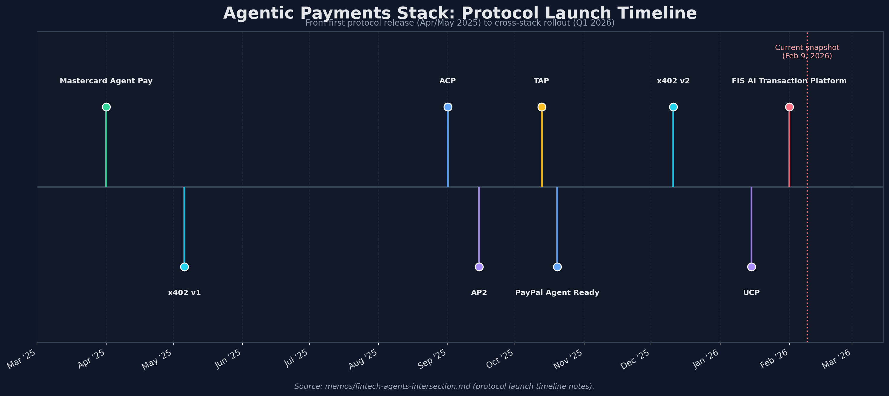
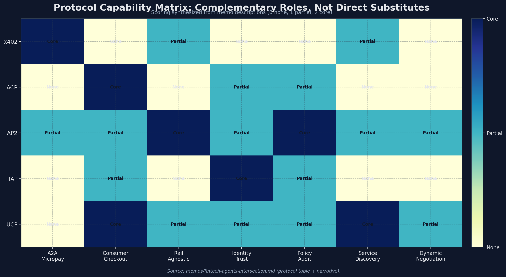
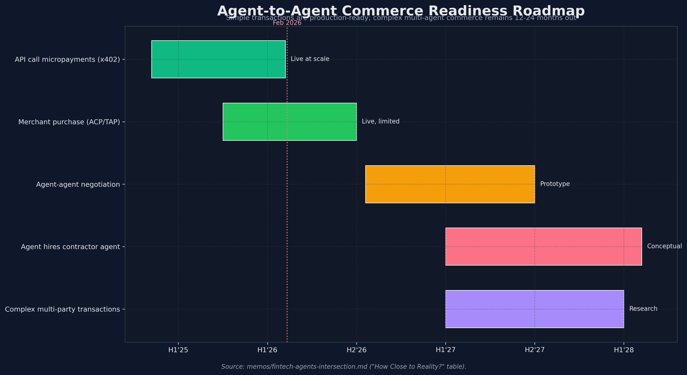

# The Fintech x AI Agents Intersection: Investment Opportunities at the Convergence

**Date:** February 2026
**Classification:** Research Memo -- Section for Final Investment Memo

## Memo Navigation

- Start Here: [Top-Level Takeaways](00-top-level-takeaways.md)
- Full Hierarchy: [Memo Index](README.md)
- Decision Layer: [IC Memo](investment-committee-memo-agent-fintech-infrastructure-2026-02-09.md), [Top 15 Opportunities](investment-opportunities.md)
- Related: [Agent-Fintech Deep Dive](agent-fintech-intersection-deep-dive.md), [x402 Research Memo](x402-research-memo.md)

---

## Executive Summary

The convergence of fintech and AI agents represents what may be the most transformative intersection in financial technology since the emergence of mobile payments. In 2025-2026, we are witnessing the birth of an entirely new economic layer -- one where autonomous AI agents hold wallets, make payments, manage finances, and transact with each other without human intervention.

Four major payment protocols (x402, ACP, AP2, TAP) launched within months of each other in 2025, backed by Coinbase, Stripe/OpenAI, Google, and Visa respectively. The agentic commerce market is projected to influence **$1T+ in e-commerce spending** near-term, with McKinsey estimating the global agentic commerce opportunity at **$3-5 trillion by 2030**. a16z projects AI agents could drive **$30 trillion in purchases by 2030**.

The critical insight: **we are at the "Stripe 2010" moment for agentic finance**. The infrastructure being built today -- agent wallets, payment protocols, identity systems, compliance frameworks -- will define the next decade of financial services, just as Stripe's payment APIs defined the last decade of internet commerce.

## Key Charts








---

## 1. Agentic Payments Infrastructure

### The Four Protocols

The agentic payments landscape crystallized in 2025 with four complementary protocols, each backed by a tech/finance giant:

| Protocol | Creator | Launch | Settlement Rail | Primary Use Case |
|----------|---------|--------|-----------------|------------------|
| **x402** | Coinbase + Cloudflare | May 2025 | On-chain stablecoins (USDC) | Agent-to-agent micropayments, pay-per-use APIs |
| **ACP** (Agentic Commerce Protocol) | Stripe + OpenAI | Sept 2025 | Card/ACH via Stripe | Consumer-facing agentic checkout, B2C commerce |
| **AP2** (Agent Payments Protocol) | Google | Sept 2025 | Rail-agnostic (supports x402) | Multi-party orchestration, authorization, audit |
| **TAP** (Trusted Agent Protocol) | Visa + Akamai | Oct 2025 | Visa network | Agent identity verification, merchant trust |

**Critical observation:** These protocols are **complementary layers, not competitors**. Google's AP2 explicitly integrates x402 for crypto settlement. Visa's TAP handles identity/trust. Stripe's ACP handles fiat checkout. This layered architecture mirrors the internet protocol stack -- and suggests that value will accrue at multiple levels.

**Additional infrastructure:**
- **UCP** (Universal Commerce Protocol) -- Google, launched Jan 2026 at NRF with Shopify and Walmart. Acts as "the HTTP of shopping" -- an open-source standard for end-to-end agentic commerce (discovery, negotiation, checkout, fulfillment).
- **Mastercard Agent Pay** -- Launched April 2025; introduced "Mastercard Agentic Tokens" built on existing tokenization; rolled out to all US cardholders by November 2025. Now integrating with Google's UCP.
- **PayPal Agent Ready** -- Launched October 2025; instantly unlocks millions of existing PayPal merchants for AI-initiated payments; general availability early 2026.
- **FIS AI Transaction Platform** -- First offering enabling banks to lead in agentic commerce, available Q1 2026.

### Key Companies Building on Top

| Company | Funding | What They Do | Investor Signal |
|---------|---------|-------------|-----------------|
| **Kite** | $33M Series A (PayPal Ventures + General Catalyst; extended by Coinbase Ventures) | Agent Identity Resolution ("Kite AIR"); programmable identity, stablecoin payments, policy enforcement on a blockchain optimized for agents. Founded by team from Databricks, Uber, Berkeley. | **Strong.** Triple-backed by PayPal, GC, Coinbase. Building the identity + payments layer for agents. |
| **Catena Labs** | $18M Seed (a16z crypto) | First regulated, AI-native financial institution for the agent economy. Agent Commerce Kit (ACK-ID for identity using W3C DIDs/VCs). Founded by Sean Neville (co-founder of Circle, invented USDC). | **Very strong.** a16z crypto lead, Circle/Coinbase/CoinFund participation. Regulatory-first approach is differentiated. |
| **Skyfire** | $9.5M Seed (Coinbase Ventures, a16z CSX) | Payment network for AI agents. Exited beta March 2025. Thousands of daily transactions. USDC settlement. | **Early but promising.** First pure-play agent payment network at scale. |
| **Natural** | $9.8M Seed (Abstract + Human Capital) | Agentic payments for real-world workflows (logistics, property, procurement, healthcare). Backed by CEOs of Bridge, Mercury, Ramp, Vercel, Unit. | **Strong angel signal.** The operator-investor backing is remarkable -- every major fintech CEO invested. |
| **Crossmint** | $23.6M (Ribbit Capital, Franklin Templeton) | Agent wallet and payment APIs across 40+ blockchains. GOAT SDK: 150K downloads. 40K+ companies on platform. 1,100% subscription revenue growth YoY. | **Strong traction.** Ribbit + Franklin Templeton = serious institutional backing. Real revenue growth. |
| **Ampersend** (Edge & Node) | Part of The Graph ecosystem | Management dashboard for agent payments. Extends x402 + Google A2A with observability, automation, compliance. | **Infrastructure play.** Agent payment observability is an underserved layer. |
| **PayAI** | Token-based | Largest x402 facilitator after Coinbase. Multi-chain expansion (Q1 2026). Building dispute resolution for agent transactions. | **Ecosystem incumbent.** Leading third-party facilitator. |
| **UQPAY** | N/A | First commercial-grade compliant x402 platform. Launched Feb 2026. Supports both merchant and AI-initiated transactions. | **Compliance differentiation.** Addresses x402's biggest gap. |
| **Fluora** | N/A | MonetizedMCP marketplace -- AI agents discover and purchase services autonomously, with x402 payments. | **Discovery layer.** The "app store" for agent-purchasable services. |

### Protocol Traction Comparison (as of early 2026)

| Protocol | Production Status | Transaction Volume | Ecosystem Partners |
|----------|------------------|-------------------|-------------------|
| **x402** | Live (V2 Dec 2025) | 157.6M txns, $600M+ volume | Coinbase, Cloudflare, Google, 10+ chains |
| **ACP** | Live in ChatGPT | Not disclosed | Stripe, OpenAI, Salesforce, Shopify, BigCommerce, PwC; retailers URBN, Etsy, Coach |
| **AP2** | Early adoption | Not disclosed | 60+ partners: Mastercard, Amex, PayPal, Adyen, Worldpay, Salesforce, Intuit |
| **TAP** | Pilot stage | Hundreds of transactions | 100+ partners; 30+ building in sandbox; 20+ agent integrations |

---

## 2. AI-Native Financial Agents

Autonomous financial agents are moving from concept to production. The market is stratifying into distinct archetypes:

### AI CFO / Finance Automation Agents

| Company | Funding | Product | Traction |
|---------|---------|---------|---------|
| **ChatFin** | N/A | AI Super Agent for finance. Connects to NetSuite/ERPs. Executes work across entire finance departments. | Customers report close reduced from 8 days to 3 days; forecast accuracy from 68% to 91% |
| **Truewind** | $17.5M (Series A led by Thomson Reuters Ventures) | AI-powered digital staff accountant. Month-end close automation. | Revenue grew 4x YoY; working with top firms (EisnerAmper, Frank Rimerman) |
| **Rillet** | Backed by Sequoia, a16z, ICONIQ, First Round | AI-native ERP for mid-market. Built by accountants, for accountants. | Strong investor signal; positioned for "AI-native replacement" of legacy ERPs |
| **Ramp** | $1.6B+ total | "Agentic Procurement" engine that auto-scans SaaS subscriptions, initiates cancellations for duplicates. Evolved from corporate card to AI-native finance platform. | Dominant in startup/SMB corporate cards; adding autonomous agent capabilities |
| **Payhawk** | N/A | AI Financial Controller Agent: chases receipts, reviews expenses, answers transaction questions. | Enterprise deployment across European markets |

### AI Trading / Investment Agents

The autonomous trading agent space is more developed in crypto/DeFi (see Section 4) but emerging in traditional finance:

- **58% of finance organizations** have now adopted AI, up from 37% the prior year
- CFOs broadly expect agentic AI to shift from experimentation to enterprise-wide impact in 2026
- The CB Insights Fintech 100 includes **17 companies** using AI for accounting/payroll/treasury
- **Intuit** integrated "Assist" AI into QuickBooks with 2026 "Tax-Loss Harvesting Agents"

### Investment Thesis for AI Financial Agents

The pattern mirrors the broader agent economy: **vertical depth creates moats**. Companies like Truewind (accounting) and ChatFin (enterprise finance) that build deep domain expertise + proprietary training data will be defensible. Generic "AI CFO wrapper" products will not survive.

**Key metric to watch:** The "CFO Stack" saw **$1.8B across 90 deals** in Q4 2025 per PitchBook -- this is the fastest-growing sub-sector within fintech.

---

## 3. Agent Wallets & Financial Identity

This is perhaps the most critical infrastructure layer -- and the least solved.

### The Problem

AI agents need to:
1. **Hold money** -- wallets that agents control with programmatic guardrails
2. **Prove identity** -- "who" is this agent, and who is responsible for its actions?
3. **Operate within limits** -- spending caps, approved vendors, scope restrictions
4. **Maintain audit trails** -- every action traceable back to responsible human/organization

Traditional financial infrastructure (bank accounts, KYC processes, payment credentials) was designed for humans. None of it works for autonomous agents.

### Agent Wallet Infrastructure

| Solution | Provider | Approach |
|----------|----------|----------|
| **AgentKit + MPC Wallets** | Coinbase (CDP) | Framework-agnostic toolkit. Every AI agent gets a crypto wallet with onchain actions. Gasless transactions via Smart Wallet API. Supports EVM + Solana. Thousands of developers building. |
| **Payments MCP** | Coinbase | Enables LLMs (Claude, Gemini) to access blockchain wallets directly. Turns wallets into agent-controlled accounts. |
| **GOAT SDK** | Crossmint | Most downloaded open-source library for connecting AI agents to blockchain. 150K downloads. 40+ blockchain support. |
| **1Pay.ing** | Independent | x402 payment wallet for instant micropayments with integrated checkout flows. |
| **Ampersend** | Edge & Node (The Graph) | Dashboard for managing agent wallets: spending limits, policies, activity tracking across networks. |

### Agent Financial Identity

| Solution | Provider | Approach |
|----------|----------|----------|
| **Kite AIR** (Agent Identity Resolution) | Kite | Programmable identity enabling agents to authenticate, transact, and operate independently. Blockchain-optimized. |
| **ACK-ID** | Catena Labs | W3C Decentralized Identifiers (DIDs) + Verifiable Credentials (VCs). Cryptographic ownership chains from legal entities to their agents. |
| **TAP** | Visa + Akamai | Identity verification distinguishing legitimate AI agents from malicious bots for merchant checkout. |
| **Agentic Tokens** | Mastercard | Tokenization for agent-initiated payments, building on proven mobile/card-on-file infrastructure. |

### The "Know Your Agent" (KYA) Framework

A new compliance paradigm is emerging alongside traditional KYC:

**Four pillars of KYA:**
1. **Establish** who and what the agent is
2. **Confirm** what it's permitted to do and for whom
3. **Maintain** clear accountability for every action
4. **Monitor** behavior continuously to ensure compliance

Critical insight from the World Economic Forum: "Agent identity is only as trustworthy as the underlying human or organizational identity it represents -- without high-assurance KYC, even the strongest KYA framework collapses."

FIS is launching "Know Your Agent" (KYA) data capabilities for bank issuers in Q1 2026 -- the first mainstream financial infrastructure provider to formalize this concept.

### Investment Implications

Agent wallets and identity represent the **foundational infrastructure layer** for the entire agent economy. This is analogous to Plaid's role in connecting fintech apps to bank accounts -- whoever builds the "Plaid for agent identity" captures enormous value.

**Key gap:** No company has yet built a unified solution that combines wallet + identity + compliance + multi-protocol support. The market is fragmented across crypto-native (Coinbase, Crossmint) and traditional (Visa, Mastercard) approaches. The winning solution likely bridges both worlds.

---

## 4. DeFi x Agents

### The DeFAI Movement

The intersection of DeFi and AI agents -- dubbed "DeFAI" -- represents one of the most active areas of experimentation in crypto:

| Project | TVL/Traction | What It Does |
|---------|-------------|--------------|
| **Almanak** | 300%+ TVL growth in 2025; 100K+ active users; $6M annualized revenue from alUSD vault | AI swarm of 18 specialized agents that create, test, and deploy DeFi strategies. Zero-code strategy builder. 8-12% yields on stablecoins. Raised $8.45M. |
| **CoW Protocol** | Established DEX aggregator | AI-optimized order routing with MEV protection. Composable and programmable for agent workflows. |
| **Stablecoin AI Agents on Base** | $20M+ TVL (June 2025) | Various AI agents running automated yield strategies on Base |

### AI Agent Crypto Tokens

A speculative but significant sub-market emerged in late 2024-early 2025:

| Token/Project | Peak Market Cap | What It Is |
|--------------|----------------|------------|
| **Virtuals Protocol (VIRTUAL)** | ~$800M (Jan 2025) | Largest AI agent creation platform by market cap. Anyone can create an agent + launch a token. 850% price surge in late 2024. |
| **ai16z** | $2B (Jan 2025) | First DAO led by an autonomous AI agent ("Marc Andreessen"). Eliza multi-agent framework on Solana. 1.1B fixed token supply. |
| **AIXBT** | ~$500M | AI-powered crypto market intelligence agent. Largest Virtuals-based agent. |

### DeFAI Use Cases

1. **Automated yield optimization** -- AI agents dynamically allocate across DeFi protocols to maximize risk-adjusted returns
2. **Active LP management** -- Agents rebalance liquidity positions based on real-time market conditions
3. **MEV extraction/protection** -- AI agents compete for (or protect against) Maximal Extractable Value
4. **Smart contract auditing** -- Agents analyze contracts for vulnerabilities before deployment
5. **Governance participation** -- Agents vote and participate in DAO governance based on configured preferences

### Risks and Challenges

- **AI-on-AI MEV warfare**: A new "dark forest" is emerging where autonomous agents fight for MEV, creating potential market manipulation risks
- **Oracle manipulation**: Agents that rely on price oracles are vulnerable to manipulation
- **Overtrading**: AI agents without proper guardrails can generate excessive transaction costs
- **Regulatory ambiguity**: Autonomous DeFi agents operate in a regulatory grey zone

### Investment Assessment

DeFAI is **high-upside, high-risk**. The infrastructure plays (Almanak, CoW Protocol) are more investable than the speculative token launches. The key filter: **does the project have real TVL and revenue, or is it purely token-driven?** Almanak's $6M annualized revenue from actual yield generation is a meaningful signal.

---

## 5. Agent-to-Agent Commerce

### Current State

Agent-to-agent (A2A) commerce -- where AI agents autonomously discover, negotiate with, and pay each other -- is the most futuristic but also the most infrastructure-dependent segment.

**What exists today:**
- x402 enables stateless, HTTP-native payments between agents (157.6M cumulative transactions)
- Google's A2A protocol enables agent-to-agent discovery and communication
- Fluora's MonetizedMCP marketplace enables agents to discover and purchase services
- PayAI facilitates agent payments as the largest third-party x402 facilitator
- Ampersend provides management/observability for A2A payment flows

**What is actively being built:**
- Dispute resolution systems for agent transactions (PayAI, Q2-Q3 2026)
- Reputation systems for agent reliability
- Dynamic pricing negotiation between agents
- Multi-step workflow orchestration (agent chains involving payments)

### How Close to Reality?

**The honest answer: for simple transactions, it is here. For complex commerce, it is 12-24 months away.**

| Scenario | Status | Timeline |
|----------|--------|----------|
| Agent pays for API call (x402) | **Live, at scale** | Now |
| Agent buys product from merchant (ACP/TAP) | **Live, limited deployment** | H1 2026 for broad adoption |
| Agent negotiates price with another agent | **Prototype/hackathon** | H2 2026-2027 |
| Agent hires and pays contractor agent | **Conceptual** | 2027+ |
| Complex multi-party agent transactions | **Research** | 2027-2028 |

### Missing Infrastructure

1. **Agent reputation/trust systems** -- How does an agent evaluate whether another agent is reliable?
2. **Dispute resolution** -- What happens when an agent transaction goes wrong?
3. **Dynamic pricing protocols** -- Agents need to negotiate prices in real-time
4. **Escrow/conditional payments** -- Complex transactions need payment guarantees
5. **Cross-protocol interoperability** -- Transactions spanning x402 + ACP + AP2 seamlessly
6. **Service-level agreements** -- Machine-readable SLAs for agent services

### Investment Implication

Agent-to-agent commerce infrastructure is **the highest-upside whitespace** in this entire landscape. The companies that build the reputation, discovery, dispute resolution, and orchestration layers for A2A commerce will capture enormous value -- but the timing risk is significant.

---

## 6. Regulatory Considerations

### The Regulatory Landscape

Financial regulation for autonomous AI agents is the critical uncertainty factor for this entire investment thesis. The regulatory framework is evolving rapidly but unevenly:

| Jurisdiction | Approach | Key Developments |
|-------------|----------|------------------|
| **US (SEC)** | 2026 Examination Priorities highlight AI, compliance, and emerging technology. No agent-specific rules yet. | SEC focused on "AI-washing" enforcement; FINRA requires firms to assess compliance before deploying AI agents |
| **US (Federal)** | GENIUS Act (July 2025) provides stablecoin clarity. No comprehensive AI agent financial regulation. | FIS launching KYA framework for bank issuers (Q1 2026). FDIC "Synapse rule" for beneficial owner recordkeeping. |
| **UK (FCA)** | Principles-based, outcomes-focused. Explicitly NOT introducing AI-specific rules. | FCA reaffirmed December 2025 it will not create AI-specific regulation, citing rapid evolution |
| **EU** | EU AI Act + AMLA (Anti-Money Laundering Authority) operational 2025. Most prescriptive approach. | Digital asset providers held to same AML/KYC as banks. AMLA directly supervises high-risk institutions. |

### Key Regulatory Risks

1. **Money transmission**: Are agent payment facilitators money transmitters? The answer varies by jurisdiction and is largely untested for autonomous agents.

2. **Securities law**: Autonomous trading agents raise questions about market manipulation, insider trading, and fiduciary duty. FINRA's 2026 Regulatory Oversight Report explicitly covers AI/GenAI risks.

3. **KYC/AML compliance**: Agents cannot pass traditional identity verification. The KYA framework is emerging but not yet codified in regulation. x402 has no built-in KYC/AML.

4. **Liability chain**: When an agent makes an unauthorized or erroneous financial transaction, who is liable? The agent's developer? The platform? The user who deployed it? The LLM provider? This is **completely unresolved** legally.

5. **Deepfake/synthetic identity fraud**: Identity attacks driven by AI are up **1,100% (deepfake)** and **300% (synthetic ID)** in 2025. Autonomous agents both enable and are vulnerable to these attacks.

6. **Board fiduciary duty**: Regulators are framing failure to implement AI governance as a failure of board duty of oversight.

### Regulatory Moat Opportunity

Companies that solve compliance for agent finance will build **the most defensible moats** in this space:
- **Catena Labs** (regulated AI-native financial institution, a16z backing)
- **UQPAY** (first compliant x402 platform)
- **Kite** (agent identity resolution with policy enforcement)

Historically in fintech, **regulation is a moat, not just a cost** (see: Wise's 41-country license portfolio, Revolut's banking licenses). The same will be true for agent finance.

---

## 7. New Business Models

The ability for AI agents to autonomously transact unlocks entirely new business models that could not exist before:

### Models That Are Live Today

| Model | How It Works | Example |
|-------|-------------|---------|
| **Pay-per-API-call** | Agents pay for each API request in real-time via x402. No subscriptions, API keys, or accounts. | Firecrawl (pay-per-crawl), DappLooker (pay-per-query), Daydreams (pay-per-inference) |
| **Agent-mediated checkout** | AI agents complete purchases on behalf of consumers. Merchants pay for agent-driven traffic. | Stripe ACP + ChatGPT Instant Checkout; PayPal Agent Ready; Visa Intelligent Commerce |
| **Monetized agent services (MCP)** | Agents publish services other agents can discover and pay for via MonetizedMCP. | Fluora marketplace |
| **AI-native financial operations** | Autonomous agents handle entire finance workflows, charging per-action or as a managed service. | ChatFin, Truewind, Ramp's agentic procurement |

### Models Emerging in 2026

| Model | How It Works | Investment Signal |
|-------|-------------|-------------------|
| **Agent-as-a-service** | Specialized agent "workers" that other agents or businesses hire for specific tasks, paid per-task. | Natural ($9.8M seed) is building this for logistics, property, procurement |
| **Agent marketplace with payment rails** | Platforms where agents list services, other agents discover and pay for them automatically. | Fluora + x402; Google UCP Phase 2 |
| **Autonomous treasury management** | AI agents that manage corporate cash positions, optimize yield, and execute payments based on cashflow predictions. | Ramp, ChatFin, emerging startups |
| **Dynamic agent pricing/negotiation** | Agents negotiate prices in real-time based on supply/demand, creating more efficient markets. | Part of Google UCP Phase 2 roadmap (late 2026) |
| **Agent subscription management** | Agents that autonomously manage, negotiate, and cancel subscriptions on behalf of businesses/consumers. | Ramp's "Agentic Procurement" already doing this |

### Models on the Horizon (2027+)

- **Agent insurance/guarantees**: Insurance products for agent-initiated transactions
- **Agent credit/lending**: Extending credit to agents based on their historical performance and the creditworthiness of their principals
- **Agent-to-agent derivatives**: Automated hedging and risk management between agent systems
- **Autonomous investment DAOs**: Fully AI-managed investment vehicles

### The Revenue Model Shift

The key insight: **the business model of the internet is shifting from subscription to usage-based, mediated by agents.** When agents can autonomously pay per-request, the friction that justified subscriptions (payment setup, account creation, billing) disappears. This has profound implications:

- **SaaS companies** need to offer agent-accessible, pay-per-use pricing or risk being invisible to the agent economy
- **API companies** that implement x402 or similar protocols gain access to the agent economy with minimal effort
- **Marketplace companies** that make their inventory agent-discoverable (via UCP, MCP) capture agent-driven traffic

---

## 8. The "Stripe Moment" of Agentic Finance

### Historical Parallel

In 2010, Stripe launched with a simple thesis: internet payments were too hard for developers. Seven lines of code to accept payments. Today, Stripe processes hundreds of billions of dollars annually at a $106.7B valuation.

The agentic finance ecosystem is at an analogous moment. Agent payments are too hard. The protocols exist but are fragmented. The infrastructure is incomplete. Whoever makes it "seven lines of code for an agent to pay another agent" will build the next Stripe-scale company.

### The Candidates

| Company | "Stripe Moment" Thesis | Strength | Weakness |
|---------|----------------------|----------|----------|
| **Coinbase (x402 + AgentKit + CDP)** | Already has the protocol (x402), the wallet infra (AgentKit), and institutional backing (Cloudflare, Google). Could become the default payments backbone for agent-to-agent commerce. | Largest ecosystem; live at scale (157.6M txns); Google/Visa integration. | Crypto-only (requires stablecoin wallet); centralization risk (most traffic through Coinbase facilitator); regulatory gaps. |
| **Stripe (ACP + Agentic Commerce Suite)** | Extending its existing dominance in internet payments to agent commerce. ACP in production inside ChatGPT. Massive merchant base. | Already the payments backbone of the internet; existing merchant relationships; production deployment; fiat-native. | Fiat-only (higher costs, slower settlement); not designed for micropayments or A2A; subscription model, not usage-based. |
| **Google (AP2 + UCP + A2A)** | Protocol layer play: AP2 for payments, UCP for commerce, A2A for communication. Rail-agnostic -- bridges x402 and fiat. | 60+ partners; rail-agnostic; bridges crypto and fiat; massive distribution. | Not a payments company; protocols without implementation; depends on others for execution. |
| **Visa (TAP + Intelligent Commerce)** | Trust and identity layer for agent commerce. 100+ partners. Millions of merchants already on Visa network. | Largest payment network globally; trust/brand; existing merchant relationships. | Traditional infrastructure (slow, expensive); not built for micropayments; agent identity only, not payments execution. |
| **Kite** | Purpose-built L1 for agentic payments with identity resolution. Only company solving identity + payments + policy in one stack. | $33M from PayPal + GC + Coinbase; identity-first approach; purpose-built. | Very early; unproven at scale; L1 adoption risk. |
| **Catena Labs** | First regulated AI-native financial institution. If agents need "bank accounts," Catena is building the bank. | a16z crypto; Circle founder; regulatory-first; ACK-ID identity protocol. | Very early; regulatory path is long; $18M seed is small for a financial institution. |

### Assessment

**There will not be a single "Stripe for agents."** The agentic payments stack is inherently multi-layered:

```
Layer 5: Agent Marketplaces & Discovery (Fluora, UCP, MCP)
Layer 4: Agent Orchestration & Commerce (Stripe ACP, PayPal Agent Ready)
Layer 3: Trust & Identity (Visa TAP, Kite AIR, Catena ACK-ID, Mastercard Agent Pay)
Layer 2: Payment Authorization & Governance (Google AP2)
Layer 1: Settlement (x402 for crypto, Stripe/Visa/Mastercard for fiat)
Layer 0: Wallets & Financial Identity (Coinbase AgentKit, Crossmint, Catena)
```

**The most likely outcome:** Coinbase/x402 becomes the default settlement layer for agent-to-agent micropayments (crypto), while Stripe/ACP becomes the default for agent-to-merchant consumer commerce (fiat). Google's protocols bridge the two. Visa/Mastercard provide the trust and identity layer. And a new company -- possibly Kite, Catena, or one not yet founded -- builds the unified "agent financial services platform" that spans all of these.

### The Investable Wedge

The "Stripe moment" company will likely emerge from one of these wedges:

1. **The agent wallet company** that becomes the default way agents hold and manage money (Crossmint is closest today)
2. **The agent identity company** that becomes the trust layer for all agent transactions (Kite and Catena are racing)
3. **The agent compliance company** that makes it easy for any agent to be financially compliant (UQPAY, Catena)
4. **The agent payment orchestrator** that abstracts across all protocols and rails (nobody has built this yet -- **this is the biggest whitespace**)

---

## 9. First-Principles Outlook: Base Rates, Value Capture, and Crypto Rails (Updated Feb 9, 2026)

### Base-Rate Anchors

| Base-Rate Metric | Latest Data Point | Implication for Agent-Fintech |
|------------------|-------------------|-------------------------------|
| Global payments economics | ~$2.5T revenue on ~$2.0 quadrillion flows (2024) | Even small shifts in control points can support multi-billion-dollar outcomes. |
| ACH scale (US) | $93T in 2025 | Legacy rails remain dominant; new rails must coexist, not assume displacement. |
| RTP adoption speed (US) | >$1T cumulative value since launch (2017) | New rails can scale, but institutional migration is measured in years. |
| FedNow usage (2024) | 1,192 institutions, 1.5M transactions | Distribution can scale faster than usage; behavior change is the bottleneck. |
| Global remittance price | 6.49% average total cost | Cross-border remains a structural pain point and a stablecoin opening. |
| E-commerce checkout friction | 70.19% cart abandonment | Agent-led checkout can capture value by reducing decision and form-fill friction. |
| Fraud baseline | $33.41B global card fraud losses; $12.5B US consumer fraud losses | Autonomy increases fraud exposure; risk/compliance spend is mandatory, not optional. |
| Stablecoin scale | $300B+ supply; ~$46T raw and ~$9T adjusted annualized volume | Crypto rails are now system-relevant for select flows, especially machine-native payments. |
| Stablecoin risk signal | 63% of illicit crypto volume uses stablecoins (illicit is 0.14% of all on-chain volume) | Compliance and monitoring layers are prerequisite for institutional scale. |

### First-Principles Value-Capture Model

Assumptions:
1. Agent-influenced commerce by 2030 falls in a $1T (low) to $5T (high) range; base case $3T.
2. Monetizable net take-rate across the full stack ranges from 20-80 bps depending on rail mix and software attach.
3. Most durable margin sits above rails (identity, authorization, compliance, fraud, orchestration, and discovery).

| Scenario | Agent-Influenced GMV | Net Stack Take Rate | Revenue Pool |
|----------|----------------------|---------------------|--------------|
| Low | $1T | 20 bps | $2B |
| Base | $3T | 50 bps | $15B |
| High | $5T | 80 bps | $40B |

Estimated share of the eventual profit pool:
1. Trust/control layer (identity, authorization, compliance, fraud): **35-45%**
2. Discovery/distribution layer (agent ranking, marketplace access): **20-30%**
3. Cross-rail orchestration layer: **15-20%**
4. Settlement/facilitation rails: **10-15%**

### Crypto Rails vs. Fiat Rails for Agents

| Dimension | Crypto Rails (Stablecoin/x402-like) | Fiat Rails (Card/ACH/RTP) |
|-----------|-------------------------------------|----------------------------|
| Micropayment economics | Strong advantage. At $1 ticket size: ~1.5c fee (1.5%) vs ~32.9c on card pricing. | Weak for small tickets because fixed fee component dominates. |
| Cross-border settlement | Strong advantage: near-24/7 settlement and lower intermediary friction. | Slower, often multi-party and batch dependent. |
| Consumer protection | Weak by default (no native chargeback standard). | Strong, with mature dispute/refund/issuer protections. |
| Regulatory clarity | Improving, but fragmented and jurisdiction-dependent. | Mature, with clear merchant and issuer frameworks. |
| Merchant acceptance | Still uneven outside crypto-forward merchants. | Ubiquitous global acceptance and familiar checkout patterns. |
| Agent-native programmability | Strong (machine wallets, programmable transfer logic). | Improving, but often layered through existing human-centric UX. |

Conclusion: crypto rails are likely to win specific lanes (API micropayments, cross-border B2B, machine-to-machine settlement), while mainstream consumer checkout remains fiat-led in the medium term.

### Probability-Weighted Outcomes by 2030

| Scenario | Probability | What Happens |
|----------|-------------|--------------|
| Hybrid default | 55% | Consumer agent commerce remains card/bank front-end; stablecoins expand in back-end settlement and specific niches. |
| Multi-rail equilibrium | 30% | Orchestration layer routes across card, A2A, ACH/RTP, and stablecoins based on cost/risk/latency. |
| Crypto-first mainstream | 10% | Stablecoin rails become default for broad agent commerce, including mainstream consumer checkout. |
| Adoption stalls | 5% | Liability, fraud, and regulatory frictions materially delay autonomous finance adoption. |

### Frontier Blog/Substack Signal Check

1. a16z's agent-payments analysis frames the market as a layered stack where authorization, trust, and rails interoperate, not winner-take-all at one protocol.
2. Fintech Brainfood's field observations reinforce that distribution and merchant workflow integration will matter as much as rail innovation.
3. Across both viewpoints, the overlap is clear: value capture concentrates in control points (trust, policy, routing), not commodity transaction transport.

---

## Investment Framework: Fintech x Agents

### Tier 1 -- Highest Conviction (Infrastructure)

| Opportunity | Why | Key Companies | Risk |
|-------------|-----|---------------|------|
| **Agent payment infrastructure** | $30T projected market by 2030 (a16z); four protocols from tech giants; live production deployments | Kite, Catena Labs, Skyfire, Natural, Crossmint | Protocol fragmentation; regulatory uncertainty |
| **Agent identity & compliance** | Regulatory moat; mandatory for enterprise adoption; KYA framework emerging | Catena Labs, Kite, UQPAY | Regulatory timeline uncertainty |
| **Agent wallets** | Every agent needs a wallet; foundational infrastructure | Coinbase (AgentKit), Crossmint, 1Pay.ing | Platform risk (Coinbase dominance) |

### Tier 2 -- Strong Conviction (Applications)

| Opportunity | Why | Key Companies | Risk |
|-------------|-----|---------------|------|
| **AI-native finance/accounting** | $1.8B across 90 deals in Q4 2025; clear ROI; 58% finance orgs adopting AI | ChatFin, Truewind, Rillet, Ramp | Incumbents (Intuit, NetSuite) adding AI; moat depth question |
| **Agentic commerce enablement** | $3-5T market by 2030 (McKinsey); Stripe/Google/Visa all building | Stripe ecosystem, PayPal Agent Ready, BigCommerce | Big tech capturing value; protocol lock-in |
| **DeFAI infrastructure** | Real revenue (Almanak $6M); growing TVL; unique to crypto | Almanak, CoW Protocol | Regulatory risk; speculative token dynamics |

### Tier 3 -- Speculative / High Upside

| Opportunity | Why | Key Companies | Risk |
|-------------|-----|---------------|------|
| **Agent-to-agent commerce orchestration** | Biggest whitespace; no dominant player; enormous TAM | Ampersend, Fluora, PayAI | Very early; infrastructure dependencies; timing risk |
| **Agent payment orchestration (cross-protocol)** | Nobody abstracts across x402/ACP/AP2/TAP yet | **No clear company** -- major opportunity | May be captured by existing players |
| **Agent marketplace with payment rails** | "App Store for agent services" | Fluora (MonetizedMCP) | Cold start problem; platform dynamics |

### What to Watch

1. **Transaction volume through x402 and ACP in H1 2026** -- organic growth (not memecoin-driven) will validate the thesis
2. **Visa TAP merchant adoption** -- if Visa hits "millions of consumers using agents by 2026 holiday season," this is mainstream
3. **Regulatory clarity on agent financial identity** -- any jurisdiction that creates a KYA framework creates a massive opportunity
4. **The first $1B agent-initiated transaction volume month** -- the tipping point for infrastructure investment
5. **Cross-protocol interoperability** -- the company that bridges x402 + ACP + AP2 + TAP will have enormous leverage

---

## Key Takeaways

1. **The infrastructure window is NOW.** Just as Stripe (2010) and Plaid (2012) were founded in the "infrastructure before applications" phase of the mobile era, the companies building agent financial infrastructure in 2025-2026 will define the next decade. The founding window closes as protocols mature and incumbents entrench.

2. **Follow the protocol stack, not individual companies.** Value will accrue at multiple layers (settlement, identity, orchestration, commerce). The winning strategy is identifying which layers are most defensible and investing across the stack.

3. **Regulation is the moat.** Companies solving compliance for agent finance (Catena Labs, UQPAY, Kite) will build the deepest moats. History shows that financial regulation, while painful to acquire, creates 10x barriers to competition.

4. **Crypto and fiat will coexist.** The market is not "x402 vs. Stripe." Agent-to-agent micropayments will settle on crypto rails (x402/stablecoins) due to economics ($0.001 fees vs. $0.30+ for cards). Agent-to-merchant consumer commerce will settle on fiat rails (Stripe/Visa) due to merchant adoption. The bridge between these two worlds is a massive opportunity.

5. **The biggest risk is timing, not direction.** The direction is clear -- agents will autonomously transact, and they need financial infrastructure. The question is whether the market develops in 2026-2027 (early but large outcome) or 2028-2030 (later but potentially larger). Capital-efficient companies that can survive either timeline are the best investments.

---

*Sources: Coinbase, Stripe, Google Cloud, Visa, Mastercard, PayPal, a16z, McKinsey, World Economic Forum, FINRA, SEC, FCA, PitchBook, CB Insights, CoinDesk, The Block, TechCrunch, PYMNTS, American Banker, various company press releases and blogs. Additional quantitative anchors in Section 9 include Nacha (ACH), The Clearing House (RTP), Federal Reserve (FedNow), World Bank Remittance Prices Worldwide, Baymard checkout benchmarks, Nilson Report card fraud estimates, FTC fraud reports, and Chainalysis. Research conducted February 2026.*
