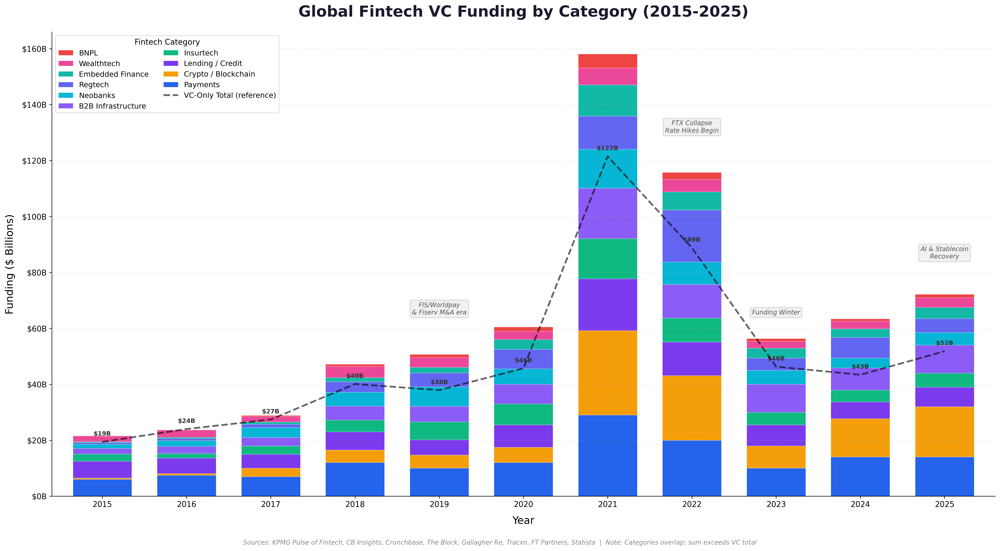
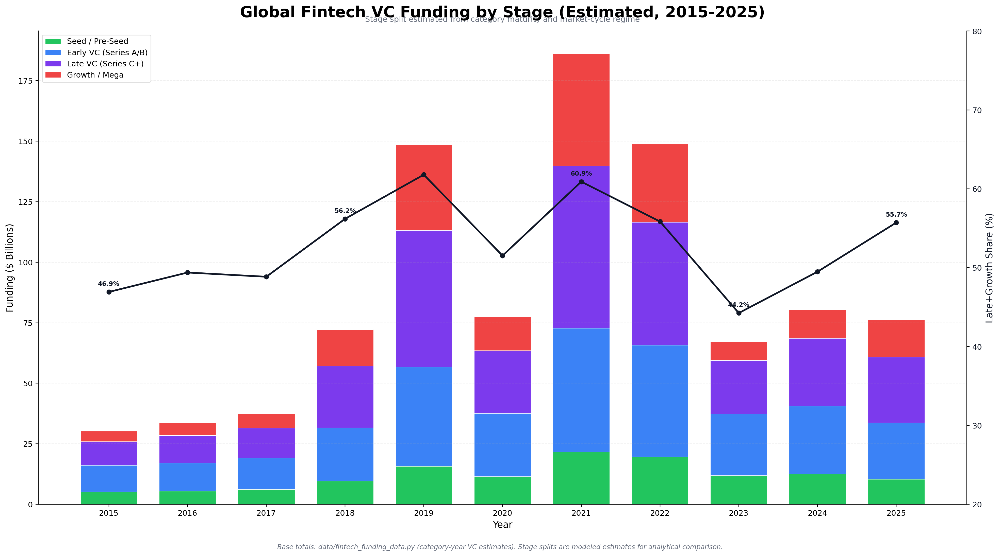
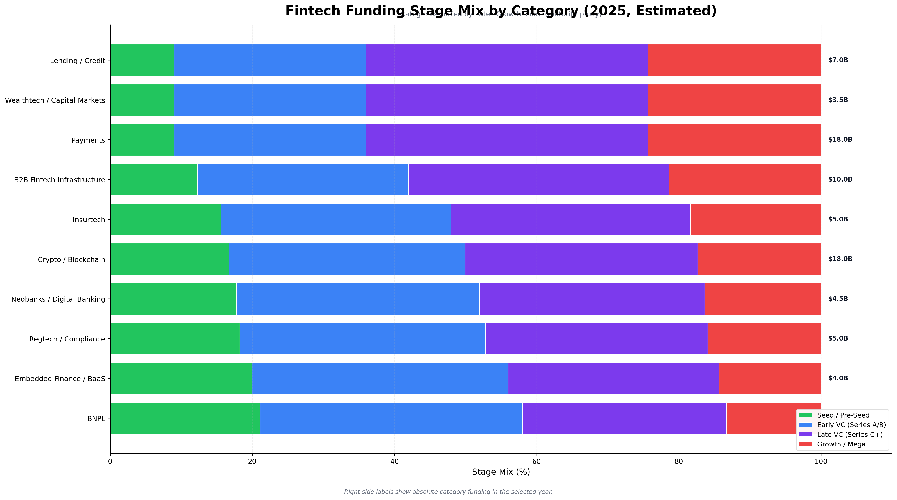

# Fintech Investment Opportunities: Deep Dive Research (2026)

> *Research compiled February 2026 | Focus: Specific investable opportunities, companies, funding rounds, and emerging players*

## Memo Navigation

- Start Here: [Top-Level Takeaways](00-top-level-takeaways.md)
- Full Hierarchy: [Memo Index](README.md)
- Decision Layer: [IC Memo](investment-committee-memo-agent-fintech-infrastructure-2026-02-09.md), [Top 15 Opportunities](investment-opportunities.md)
- Related: [Fintech Market Analysis](fintech-market-analysis.md), [Fintech x Agents Intersection](fintech-agents-intersection.md)

## Key Charts

---

## Executive Summary

This memo prioritizes investable fintech opportunities in 2026 with an explicit confidence split between confirmed data and rumor-level signals. The highest-conviction themes remain AI-native fintech workflows, compliance infrastructure for stablecoins, and multi-rail enterprise payments. M&A signals are useful, but only definitive/official transactions are treated as base-case evidence; reported talks (for example, Mastercard/Zero Hash, Coinbase/BVNK) are maintained as watchlist signals only until primary confirmation.

---

## 1. AI-Native Fintech Startups

The AI-native fintech category is the single most compelling investment theme for 2026. Unlike the prior wave of "AI-enhanced" financial products (adding ML scoring to existing workflows), this cohort is building AI-first from the ground up -- companies where AI is the product, not a feature.

### Top Companies to Watch

#### Sardine (Series C, $660M valuation)
- **What:** AI-powered fraud prevention, compliance, and credit underwriting platform
- **Funding:** $70M Series C (Feb 2025) led by Activant Capital, with a16z, Nyca Partners, GV, Geodesic Capital. Total raised: $145M
- **Traction:** 130% YoY ARR growth in 2024. 2.2B+ devices profiled. 300+ enterprise customers including FIS, Deel, GoDaddy, X (Twitter)
- **Why it matters:** Sardine is building AI "agents" for fraud and compliance operations -- autonomous systems that reduce manual workloads. The shift from rules-based fraud detection to agentic AI fraud prevention is a $50B+ TAM opportunity. Their device intelligence + behavioral biometrics approach is highly defensible
- **Risk:** Crowded fraud/compliance space (Alloy, Unit21, ComplyAdvantage)

#### FurtherAI (Series A, early stage)
- **What:** AI workspace purpose-built for insurance underwriting, claims, and compliance
- **Funding:** $25M Series A (Oct 2025) led by a16z, plus Nexus Venture Partners, Y Combinator. Total raised: $30M. Raised just 6 months after $5M seed -- one of the fastest seed-to-A progressions in insurtech
- **Traction:** Processing billions in premiums annually. Customers include Accelerant, MSI, Leavitt Group
- **Why it matters:** Insurance is a $7 trillion industry with extremely manual workflows. FurtherAI automates submission intake, policy comparison, claims processing, and compliance. Their claim: 50% reduction in expense ratios for commercial insurers
- **Risk:** Early stage; needs to prove enterprise stickiness beyond initial deployments

#### Catena Labs (Seed, $18M)
- **What:** First regulated, AI-native financial institution for the "agent economy"
- **Funding:** $18M seed led by a16z crypto. Investors include Breyer Capital, Circle Ventures, Coinbase Ventures, CoinFund. Angels: Tom Brady, Balaji Srinivasan
- **Founded by:** Sean Neville, co-founder of Circle (USDC creator)
- **Why it matters:** Catena is building financial infrastructure specifically for AI agents -- enabling agents to hold funds, make payments, verify identity, and transact autonomously. They released the open-source Agent Commerce Kit (protocols for agent identity, payments, receipts, human oversight). This is a pure-play bet on the agent economy requiring its own financial rails
- **Risk:** Very early; the "agent economy" timeline is uncertain. But the founder pedigree (Circle co-founder) and investor quality (a16z crypto) signal high conviction

#### Samaya ($43.5M raised)
- **What:** Generative AI platform for financial services -- domain-specific AI agents for compliance-heavy finance
- **Funding:** $43.5M across seed and Series A rounds
- **Why it matters:** Targeting the internal operations and client-facing services of financial institutions with secure, purpose-built AI agents tailored for regulatory environments

#### Upstart (Public, UPST)
- **What:** AI-native lending platform and underwriting marketplace
- **Status:** Public. Revenue growth projected at 62.8% YoY for 2025, 15.9% for 2026
- **Why it matters:** Pioneer of ML-based underwriting using non-traditional data (education, employment history). Expanding into auto, home, and small-dollar lending. The AI flywheel is kicking in: more data -> better models -> more lending partners -> more data
- **Risk:** Interest rate sensitivity; historical volatility in stock price

#### Pagaya (Public, PGY)
- **What:** AI-powered "second-look" underwriting -- acts as a B2B bridge between lenders and institutional investors
- **Status:** Public. Revenue growth projected at 28.4% (2025), 19.2% (2026)
- **Why it matters:** Unique model: when a borrower is denied by a primary lender, Pagaya's AI evaluates the application using 180+ data points. This creates value for both the lender (incremental origination) and the borrower (expanded access). Partner network approach is more scalable than direct lending

### AI-Native Fintech Investment Thesis

The clearest pattern: **vertical AI for specific financial workflows** is outperforming horizontal AI plays in fintech. FurtherAI (insurance), Sardine (fraud/compliance), Samaya (financial services ops), and Catena (agent payments) each own a specific domain deeply. The playbook is: (1) pick a workflow that is currently manual, expensive, and regulated; (2) build domain-specific AI that understands the regulatory context; (3) become embedded in the workflow so switching costs are high.

---

## 2. Stablecoin Infrastructure

### The Regulatory Catalyst: GENIUS Act

The GENIUS Act (Guaranteeing Essential National Infrastructure in US-Stablecoins), signed into law July 18, 2025, is the most consequential piece of US fintech legislation since Dodd-Frank. Key provisions:
- Requires 1:1 reserve backing (USD, Treasuries, money market funds)
- Monthly public reporting of reserve composition for all issuers
- Annual audited financials for issuers with >$50B in outstanding stablecoins
- Takes effect January 2027 (or 120 days after final implementing regs)
- FDIC has proposed application procedures for bank-subsidiary stablecoin issuers

The GENIUS Act creates a massive compliance infrastructure opportunity. Every stablecoin issuer needs reserve management, auditing, reporting, and compliance tooling.

### Top Companies

#### Circle (Public, CRCL)
- **What:** Issuer of USDC, the #2 stablecoin. Now public (IPO June 2025)
- **IPO:** Priced at $31/share, surged above $250. Raised $1.1B. Now trading down ~70% from highs
- **Revenue:** $1.68B in 2024, projected ~$2.6B for 2025. Q3 2025 revenue: $740M (+66% YoY)
- **Key risk:** 99%+ of revenue comes from reserve income (interest on Treasuries). A 1% rate drop = ~$441M revenue hit
- **Why it matters:** Circle launched the Circle Payment Network (CPN) in mid-2025. USDC now natively supported on 28 blockchains. On-chain transaction volume: $9.6T in Q3 2025 (+580% YoY). The question is whether Circle can diversify beyond reserve income
- **Investment angle:** The stock pullback from IPO highs creates an entry point, but the interest rate dependency is a structural concern. Bull case: CPN becomes the SWIFT of stablecoins

#### BVNK ($750M valuation)
- **What:** UK-based stablecoin infrastructure for enterprises -- APIs for sending, receiving, converting, and storing stablecoins
- **Funding:** $50M Series B (Dec 2024) led by Haun Ventures, with Coinbase Ventures, Tiger Global
- **M&A interest:** Coinbase reportedly explored a ~$2B acquisition but talks fell through (Nov 2025)
- **Why it matters:** BVNK abstracts away blockchain complexity, regulatory burden, and custody risk for enterprises. The fact that Coinbase was willing to pay $2B (nearly 3x last round valuation) validates the market opportunity

#### Zero Hash (approaching $1B valuation)
- **What:** Crypto and stablecoin infrastructure enabling any platform to offer digital assets
- **Funding:** Raised ~$100M in 2025 at nearly $1B valuation
- **M&A interest:** Mastercard reportedly in late-stage talks for a $1.5-2B transaction (credible report, not confirmed by primary filing/press release as of Feb 9, 2026)
- **Why it matters:** Reported buyer interest still signals strategic urgency around stablecoin infrastructure, but should be treated as a watchlist indicator, not a completed-deal anchor

#### Crossmint ($23.6M raised)
- **What:** Stablecoin and blockchain infrastructure for enterprises and AI agents
- **Funding:** $23.6M (Mar 2025) led by Ribbit Capital, with Franklin Templeton, Nyca, First Round, Lightspeed Faction. Additional investment from Circle Ventures (Sep 2025). MiCA authorization obtained (Jan 2026)
- **Traction:** Subscription revenue up 1,100% YoY. 40,000+ companies/developers on platform across 40+ blockchains. Clients include Adidas, Red Bull
- **Why it matters:** Crossmint sits at the intersection of stablecoins and the agent economy. Their GOAT SDK is the most downloaded open-source library for connecting AI agents to blockchain (150K downloads in 2 months). This is a potential breakout company

### Stablecoin Infrastructure Investment Thesis

The M&A signal is strong but mixed-confidence: Stripe acquired Bridge ($1.1B, official), while Mastercard/Zero Hash ($1.5-2B) and Coinbase/BVNK (~$2B) remain report-level narratives without definitive primary confirmation as of Feb 9, 2026. Major payment networks are still clearly pursuing stablecoin infrastructure. The biggest remaining opportunity is **compliance infrastructure** for the GENIUS Act -- the picks-and-shovels play for stablecoin regulation.

---

## 3. Real-Time Payments & Multi-Rail

### FedNow Ecosystem Status

- **Adoption:** ~1,500 financial institutions; targeting 8,000 of 10,000 US banks/credit unions
- **Volume:** Exceeded 1M payments in Q1 2025, 2M in Q2 2025 ($2.7B average daily volume)
- **Transaction limits:** Rapidly escalated from $500K to $10M by November 2025
- **Use cases emerging:** A2A transfers, bill pay, merchant refunds, healthcare payments, B2B commerce
- **US Treasury/FEMA disbursement usage claim** remains low-confidence until a stable primary citation is attached

### Key Companies

#### Column (Founder-owned, no external investors)
- **What:** Developer-first banking infrastructure. A nationally chartered bank with modern APIs
- **Founded by:** William Hockey (Plaid co-founder) and Annie Hockey
- **Revenue:** ~$55M (split evenly: $28M interest income, $27M non-interest income from interchange and API fees)
- **Why it matters:** Column is unique in fintech -- it owns the bank charter AND the technology layer. No middleware risk. In 2025, Column made FedNow instant payments generally available through its APIs. Partnered with Brex for USDC send/receive with automatic USD conversion. Column is the anti-Synapse: direct bank relationship, no intermediary risk
- **Investment angle:** Currently founder-owned with no external investors. If they ever raise, it would be one of the most sought-after fintech rounds. Worth monitoring closely

#### Orum (Acquired by Stripe, 2025)
- **What:** Multi-rail payment orchestration (ACH, Same Day ACH, RTP, FedNow) through one API
- **Outcome:** Acquired by Stripe in July 2025 (acqui-hire). Had raised $82.2M total
- **Signal:** Stripe's acquisition of Orum validates the multi-rail orchestration thesis. The fact that Stripe needed to buy (not build) this capability shows how hard it is to orchestrate across real-time payment rails

#### Dwolla + Plaid Integration
- **What:** Unified API for open banking + pay-by-bank across ACH, RTP, and FedNow
- **Why it matters:** The Dwolla-Plaid integration creates a single API for instant account verification + multi-rail payments. This is the template for how A2A payments will scale

#### Increase (Stripe's first employee)
- **What:** Connects fintechs and banks directly to payment networks (Visa, Fedwire, FedACH)
- **Why it matters:** Building the "Stripe for banks" -- direct API access to payment rails without intermediaries

### Real-Time Payments Investment Thesis

The transition from batch processing (ACH) to real-time payments (FedNow, RTP) is a once-in-a-generation infrastructure upgrade. The opportunity is in **multi-rail orchestration** -- platforms that intelligently route payments across ACH, RTP, FedNow, cards, and stablecoins through a single API. Stripe's Orum acquisition confirms this thesis. The remaining independent players (Column, Dwolla, Increase) are potential acquisition targets or standalone winners.

---

## 4. B2B/SMB Fintech & CFO Stack

### Market Context

- CFO Stack saw $1.8B across 90 deals in Q4 2025 (PitchBook)
- 40% of SMEs have unmet financial needs
- The "Office of the CFO" is evolving from system of record to system of intelligence
- B2B super-apps combining invoicing, treasury, expense management, lending, and procurement are gaining traction

### Top Companies

#### Ramp ($32B valuation)
- **What:** Corporate cards + expense management + AP automation + procurement + travel + treasury -- unified CFO platform
- **Funding:** $300M round (Nov 2025) led by Lightspeed Venture Partners at $32B valuation, up 42% from $22.5B in July
- **Revenue:** $1B annualized by August 2025 (up from ~$700M in early 2025)
- **Why it matters:** Ramp has become the clear winner in the CFO stack race. Their moat is the unified platform -- competitors offer pieces, Ramp offers the whole suite. AI-driven financial workflows ("autonomous finance") is their differentiation. With Brex being acquired by Capital One, Ramp is now the undisputed independent leader
- **Risk:** Valuation is steep at $32B. Revenue quality (interchange-heavy vs. SaaS) matters

#### Brex (Being acquired by Capital One for $5.15B)
- **What:** Corporate cards + expense management for startups and ecommerce brands
- **Status:** Capital One announced acquisition on January 22, 2026 for $5.15B (50% cash, 50% stock). Expected to close mid-2026
- **Revenue:** $700M
- **Signal:** The acquisition validates the CFO stack thesis but also signals that independent survival in this space requires either Ramp-level growth or a strategic acquirer. The $5.15B price (vs. $12.3B last private valuation) represents a significant down-round, suggesting Brex was unable to sustain its growth trajectory independently
- **Pedro Franceschi** (CEO) will continue leading post-acquisition

#### Mercury ($3.5B valuation)
- **What:** Startup banking platform (accounts, cards, treasury, lending)
- **Funding:** $300M Series C (Mar 2025) led by Sequoia Capital at $3.5B valuation
- **Revenue:** $650M annualized (2025), up 30% from $500M in 2024
- **Customers:** 200,000+ businesses
- **Profitability:** GAAP profitable for 3 consecutive years (net income + EBITDA)
- **Key development:** Applied for OCC national bank charter (Dec 2025) to become FDIC-insured
- **Why it matters:** Mercury is the rare fintech that is both fast-growing AND profitable. The bank charter application signals they're building for long-term independence, not a quick exit. If granted, Mercury becomes Column's peer: a tech-native company that owns its banking infrastructure

#### Melio (Acquired by Xero for $2.5-3.1B)
- **What:** B2B AP/AR bill pay platform for SMBs
- **Acquisition:** Completed October 2025 by Xero for $2.5B ($3.1B including contingent consideration)
- **Metrics at acquisition:** 80K SMB customers, $30B+ payments processed in FY25, $153M revenue ($187M annualized as of March 2025)
- **Signal:** Validates the convergence of accounting SaaS + payments. The acqui-hire of Melio's B2B payments capabilities by an accounting platform shows the CFO stack is consolidating

### European SME Champions

#### Qonto (France, targeting profitability 2025)
- Revenue: EUR 448.7M in 2024 (+44% YoY). Targeting 1M enterprise customers by 2026. EUR 52B TAM

#### Finom (Netherlands/Germany, ~$346M raised)
- Series C completed (EUR 115M, June 2025). Targeting 1M business customers by end of 2026. Team of 500

#### Tide (UK, $328.5M raised)
- Serves 10%+ of all UK SMEs. 1M+ customers across UK, Germany, India. Secured GBP 100M securitization facility (May 2025)

### CFO Stack Investment Thesis

The CFO stack is consolidating rapidly. The winners are platforms that combine **cards + AP/AR + treasury + procurement** into one AI-powered workflow. Ramp is the clear independent leader at $32B. Mercury is the best-positioned startup banking platform. The European SME neobank market (Qonto, Finom, Tide) represents a separate geographic opportunity with similar dynamics. The Xero/Melio and Capital One/Brex acquisitions signal that large incumbents are buying their way into this space -- remaining independent players will either grow to escape velocity or get acquired.

---

## 5. Embedded Finance 2.0: Post-Synapse Landscape

### What Changed After Synapse

The Synapse bankruptcy (April 2024) was the watershed moment for BaaS. Key consequences:
- 100K+ people lost access to $265M+ in funds
- FDIC proposed new "Synapse rule" for beneficial owner recordkeeping
- Regulators now require banks to have direct oversight of every customer and transaction
- The BaaS model based on middleware intermediaries between banks and fintechs is effectively dead
- **"BaaS 1.0" (rent-a-charter through middleware) is being replaced by "BaaS 2.0" (compliance-by-design, direct bank relationships)**

### Survivors and New Approaches

#### Column (see Real-Time Payments section)
- The anti-Synapse: owns the bank charter + technology. No middleware risk. The model that regulators want

#### Synctera ($94M raised, targeting breakeven early 2026)
- **What:** BaaS platform with integrated compliance (Hawk AML/CFT technology built into core platform)
- **Funding:** $15M (Mar 2025) co-led by Fin Capital and Diagram Ventures. Total raised: $94M
- **Key customer:** Signed Bolt (one-click checkout) as largest customer
- **Why it matters:** Synctera is positioning as the "compliance-first" BaaS alternative. Post-Synapse, the value proposition shifted from "fastest to launch" to "safest to launch." If they hit breakeven in early 2026 as planned, they prove the economics of compliant BaaS

#### Treasury Prime + Piermont Bank Partnership
- **What:** Treasury Prime's BankOS platform enables banks to manage embedded programs with direct oversight. Partnered with Piermont Bank for a "true collaborator" model (not "rent-a-charter")
- **Why it matters:** This partnership exemplifies BaaS 2.0: fintechs have a direct, active relationship with the bank. The bank acts as a collaborator, not a silent backend. Treasury Prime's 2026 roadmap includes deeper analytics, reconciliation tools, and compliance controls

#### Unit
- **What:** Embedded finance platform (accounts, cards, payments, lending)
- **Status:** Continues operating but facing increasing compliance costs
- **Risk:** Traditional BaaS players on slim margins are saddled with rising compliance costs. Consolidation or fire-sale situations likely for weaker players

#### Lithic ($800M valuation, $121M raised)
- **What:** Card issuing API platform -- developer tools for creating debit, prepaid, charge, and credit cards
- **Funding:** $60M Series C led by Stripes, with Bessemer, Index Ventures
- **2025 developments:** Expanded to American Express network; integrated Visa Account Level Management
- **Why it matters:** Lithic is the card issuing equivalent of what Stripe is to payments. Embedded card programs are one of the most durable embedded finance use cases because interchange revenue is proven economics

### Embedded Finance 2.0 Investment Thesis

The embedded finance market is projected at $228B by 2028 (23.8% CAGR). The winners in the post-Synapse era share three traits: (1) **compliance-by-design** (not compliance as an afterthought); (2) **direct bank relationships** (no middleware intermediaries); (3) **proven unit economics** (interchange, SaaS fees, or lending margins that work even with regulatory overhead). Column, Synctera, and Lithic each embody this in different ways. The biggest risk in this category is regulatory tightening -- the FDIC and OCC are watching closely.

---

## 6. Under-the-Radar / Pre-Series B Breakout Opportunities

### Duna (EUR 30M Series A, Feb 2026)
- **What:** AI-native business identity platform (KYC, KYB, CDD, AML)
- **Founders:** Stripe alumni (Head of Benelux/DACH + ran largest global business unit)
- **Funding:** EUR 30M Series A led by CapitalG (Alphabet's growth fund), with Index Ventures
- **Advisors/Angels:** Pieter van der Does (Adyen founder), Claire Hughes Johnson (ex-Stripe COO), Frank Slootman (Snowflake Chairman), execs from Anthropic and Goldman Sachs
- **Traction:** Customers include Plaid, CCV (Fiserv), Moss, Bol, SVEA Bank. Reporting 10.6x faster onboarding and 4.8x productivity gains
- **Why breakout:** The investor and advisor roster is extraordinary -- it reads like a who's who of fintech infrastructure. Stripe + Adyen + Anthropic DNA in a single company, solving business identity (a problem every fintech faces). Post-GENIUS Act, KYB/KYC/AML requirements are expanding. This could become the "Stripe of identity"

### Crossmint (see Stablecoin section)
- **Why breakout:** 1,100% subscription revenue growth. Sitting at the intersection of stablecoins + AI agents + enterprise blockchain. MiCA authorized. If the agent economy materializes, Crossmint has early infrastructure positioning

### FurtherAI (see AI-Native section)
- **Why breakout:** Seed to $25M Series A in 6 months. Insurance is a $7T industry with almost zero AI penetration in workflows. a16z-backed. Processing billions in premiums

### Hyperbots ($6.5M Series A)
- **What:** Proprietary LLMs fine-tuned for financial data -- targeting procure-to-pay, reporting, and reconciliation
- **Funding:** $6.5M Series A led by Arkam Ventures and Athera Venture Partners
- **Why breakout:** Very early stage but attacking the exact workflows (AP, AR, reconciliation) that represent the biggest manual burden in finance. If their domain-specific models outperform general-purpose LLMs on financial tasks, this has massive scaling potential

### Corgi ($108M funding, Jan 2026)
- **What:** AI-driven insurtech
- **Funding:** $108M raised in January 2026
- **Why watch:** Large raise for an AI insurtech signals continued investor appetite for domain-specific AI in insurance

---

## Consolidated Investment Opportunities Matrix

| Company | Stage | Valuation/Price | Category | Conviction Level | Key Risk |
|---------|-------|----------------|----------|-----------------|----------|
| **Ramp** | Late (Series D+) | $32B | CFO Stack | High | Valuation; interchange dependency |
| **Mercury** | Series C | $3.5B | Startup Banking | High | Bank charter approval uncertainty |
| **Sardine** | Series C | $660M | AI Fraud/Compliance | High | Competitive market |
| **Column** | Bootstrapped | N/A (not raising) | Banking Infra | Very High (if investable) | No fundraising pathway |
| **BVNK** | Series B | $750M (reported ~$2B acquisition interest, unverified) | Stablecoin Infra | High | May get acquired before upside captured |
| **Duna** | Series A | ~EUR 200M est. | Identity/KYC/KYB | High | Early; needs to prove enterprise scale |
| **FurtherAI** | Series A | Early | Insurance AI | Medium-High | Very early; insurance sales cycles long |
| **Crossmint** | Series A | ~$200M est. | Stablecoin + Agents | Medium-High | Agent economy timeline uncertain |
| **Catena Labs** | Seed | Early | Agent Finance | Medium | Very early; thesis-driven |
| **Synctera** | Series B | ~$300M est. | BaaS 2.0 | Medium | BaaS margins structurally thin |
| **Lithic** | Series C | $800M | Card Issuing | Medium-High | Marqeta competition |
| **Circle** | Public (CRCL) | ~$8B at IPO | Stablecoin Issuer | Medium | 99%+ revenue from interest income |
| **Upstart** | Public (UPST) | Public | AI Lending | Medium | Rate sensitivity; volatility |
| **Pagaya** | Public (PGY) | Public | AI Underwriting | Medium | Complex business model |

---

## Key M&A Signals (2025-2026)

The M&A wave is accelerating and reveals where strategic buyers see value:

| Acquirer | Target | Price | Category | Signal | Verification Status |
|----------|--------|-------|----------|--------|---------------------|
| Stripe | Bridge | $1.1B | Stablecoin infra | Payments giants need stablecoin rails | Official |
| Stripe | Orum | Undisclosed | Multi-rail payments | Real-time payment orchestration is critical | Official |
| Capital One | Brex | $5.15B | CFO Stack/Cards | Banks buying fintech capabilities | Official (pending close) |
| Xero | Melio | $2.5-3.1B | SMB AP/AR | Accounting + payments convergence | Official |
| Mastercard | Zero Hash | $1.5-2B (reported talks) | Stablecoin infra | Card networks racing for stablecoin access | Credible report; not confirmed |
| Coinbase | BVNK | ~$2B (reported exploration) | Stablecoin infra | Crypto exchanges want infrastructure layer | Rumor-level; not confirmed |

**Pattern:** Confirmed deals show large incumbents (banks, card networks, accounting platforms) acquiring fintech infrastructure at premium valuations. Report-level deals should remain watchlist-only until primary confirmation.

---

## Macro Themes Shaping 2026 Investment Decisions

1. **AI is the new platform shift.** Just as smartphones created Stripe, Square, and Venmo (2008-2012), AI is creating the next cohort of category-defining fintech companies. The best opportunities are vertical AI plays for specific financial workflows (insurance, compliance, lending, identity)

2. **Stablecoin infrastructure is being acquired at velocity.** If you want exposure, invest now or accept that the remaining independent companies will be acquired within 12-18 months

3. **The CFO stack has a winner.** Ramp at $32B with $1B revenue is pulling away. Brex's acquisition at $5.15B (vs. $12.3B peak valuation) confirms the second-place penalty

4. **BaaS 2.0 requires bank-grade compliance.** Post-Synapse, the only viable embedded finance model is compliance-by-design with direct bank relationships. Column is the gold standard

5. **The GENIUS Act creates a compliance infrastructure opportunity.** Every stablecoin issuer needs reserve management, auditing, reporting, and compliance tooling. This is the next picks-and-shovels play

6. **B2B > B2C, infrastructure > applications.** The historical pattern holds. B2B infrastructure companies (Stripe, Plaid, Adyen) have the highest success rates. The current cohort's winners will be B2B infrastructure for AI, stablecoins, and real-time payments

---

*Sources: Crunchbase, PitchBook, Fortune, TechCrunch, PYMNTS, Bloomberg, CNBC, Fintech Futures, American Banker, CB Insights, company press releases, SEC filings*
