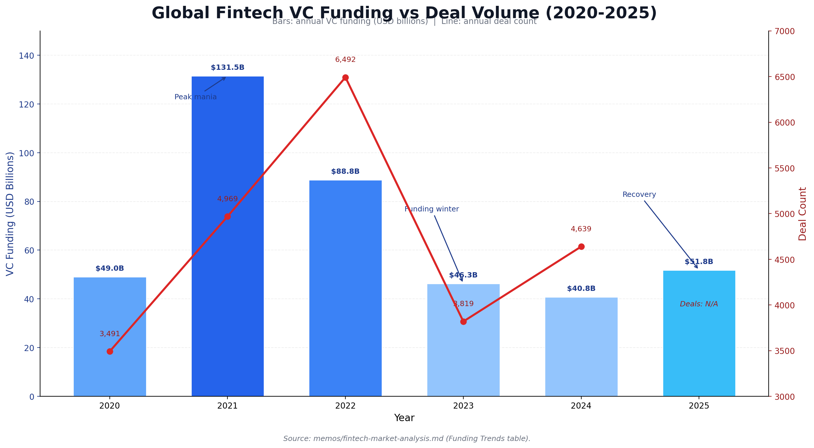

# Investment Committee Memo: Agent-Fintech Infrastructure

Date: February 9, 2026
Prepared For: Investment Committee
Prepared By: Research Team (Fintech + Agent Economy Synthesis)

## Memo Navigation

- Start Here: [Top-Level Takeaways](00-top-level-takeaways.md)
- Full Hierarchy: [Memo Index](README.md)
- Portfolio Synthesis: [Top 15 Opportunities](investment-opportunities.md)
- Supporting Deep Dives: [Agent-Fintech Deep Dive](agent-fintech-intersection-deep-dive.md), [Market Map](../research/market-map.md)

## Decision Request

Approve a focused 12-month theme allocation to agent-fintech infrastructure, centered on identity/compliance and cross-rail orchestration, with strict evidence gates before scaling position sizes.

## What Changed After Full Repo Audit

1. The strategic direction is intact, but confidence in several headline metrics should be reduced.
2. Fintech VC recovery is real, but magnitude depends on baseline: 2025 at $51.8B is +27% versus a $40.8B baseline and +19.4% versus a $43.4B baseline.
3. x402 traction appears directionally meaningful (large transaction count), but volume quality is uncertain and some underlying time-series points are estimated.
4. Certain M&A claims in prior drafts should be treated as unverified until confirmed by primary sources; do not underwrite theses on rumor-based exits.

## Top 10 Fresh-Read Takeaways

1. The repo converges on one durable thesis: value capture is most likely at trust, policy, and routing control points rather than commodity payment rails.
2. Data quality is good enough for directional decisions but uneven for underwriting; several headline numbers are explicitly estimated and should be confidence-weighted.
3. Fintech funding has recovered, but the strength of recovery is baseline-sensitive, so trend direction is stronger than absolute magnitude confidence.
4. x402 is strategically important as a design signal for machine-native commerce, but current public metrics do not yet prove durable, broad-based economic moat.
5. Stablecoins are now material infrastructure, yet adjusted “economic” volume is far below raw transfer totals, reinforcing the need for quality-of-volume filters.
6. Rail migration remains slow in practice (ACH/RTP/FedNow evidence), which supports a hybrid fiat-plus-stablecoin view through at least the medium term.
7. The strongest investable wedge remains B2B agent-finance workflows before B2C autonomy because trust, liability, and audit constraints are enterprise-solvable first.
8. Cross-rail orchestration is a high-potential whitespace, but incumbent bundling risk is real; distribution and integration depth matter as much as protocol quality.
9. Standalone facilitator models screen as low-defensibility unless bundled with compliance, policy enforcement, and workflow lock-in.
10. Portfolio posture should remain staged and milestone-based, with explicit go/no-go gates tied to organic volume quality, paid adoption, and auditability demand.

## Updated Thesis

Value is most likely to accrue to control points, not commodity pipes.

1. Compliance and identity remain the strongest moat candidates as autonomous transaction volume grows.
2. Cross-protocol orchestration remains the largest visible whitespace, but we should assume incumbents can enter quickly.
3. B2B agent-finance workflows should scale before B2C autonomy due to trust, audit, and liability constraints.
4. Crypto and fiat rails are likely complementary; winning infrastructure must abstract across both.
5. Facilitator-only models show weak defensibility; facilitator plus compliance/policy bundles may still be investable.

## Supporting Charts

## Canonical Data References

Use these canonical files for committee updates before changing headline metrics:

1. `../research/canonical-underwriting-assumptions-2026Q1.md` — single assumptions layer for memo-level requotes.
2. `../data/x402_kpi_canonical.csv` — reconciled x402 counters with confidence and conflict tags.
3. `../data/x402_organic_share_weekly.csv` — organic/speculative split baseline and method linkage.
4. `../research/rails-metrics-pack-2026Q1.md` — ACH/RTP/FedNow comparables used in rail migration framing.
5. `../research/mna-verification-ledger.md` — official vs report-level deal status.
6. `../research/memo-citation-backfill-matrix.csv` — claim-level confidence and refresh tracking.
7. `../data/investment_opportunity_conviction_overlay_2026Q1.csv` — auditable Top-15 score overlay used for tier mapping.

## Base-Rate Evidence (Added Feb 9, 2026)

1. Market size is large enough for control-point winners: global payments generated ~$2.5T revenue on ~$2.0 quadrillion flows in 2024.
2. Rail migration is slow even when infrastructure is live: ACH still processed $93T in 2025; RTP needed years to pass $1T cumulative value; FedNow had 1,192 institutions but only 1.5M transactions in 2024.
3. Existing friction and fraud are already large: 70.19% checkout abandonment, $33.41B global card fraud losses, and $12.5B reported US consumer fraud losses.
4. Stablecoins are now material but still compliance-sensitive: $300B+ supply and ~$46T raw (~$9T adjusted) annualized transfer volume, with persistent illicit-risk monitoring requirements.

## Probability-Weighted Outcomes to 2030

1. **55%: Hybrid default.** Fiat rails remain dominant for consumer-facing checkout while stablecoins grow in backend settlement and machine-native payments.
2. **30%: Multi-rail equilibrium.** Routing/orchestration platforms become the key value-capture layer across card, bank, and stablecoin rails.
3. **10%: Crypto-first mainstream.** Stablecoins become the default rail for broad agent commerce beyond niche use cases.
4. **5%: Delayed adoption.** Regulatory, liability, and fraud frictions materially slow autonomous-finance penetration.

## Frontier Signal Alignment

1. Frontier operator analysis (for example, a16z fintech/crypto) points to layered value capture across trust, authorization, and settlement rather than one protocol winner.
2. Practitioner Substack coverage (for example, Fintech Brainfood) reinforces that merchant integration and distribution control are as important as rail cost.
3. Combined implication for IC posture: prioritize trust and routing control points, treat pure rail plays as lower-conviction unless bundled with compliance/policy.

## Crypto Rail Decision Lens

Advantages:
1. Better small-ticket economics (illustrative: $1 card payment fee ~32.9c versus ~1.5c stablecoin fee at 1.5%).
2. Faster 24/7 settlement for global machine-to-machine and cross-border workflows.
3. Higher programmability for policy-driven agent transactions.

Disadvantages:
1. Weaker default consumer protection and dispute frameworks than card networks.
2. Higher compliance integration burden across jurisdictions.
3. Lower mainstream merchant acceptance and user familiarity.

## Priority Questions Before Scaling Capital

1. What share of agent payment volume is organic utility traffic versus speculative traffic, using a reproducible method?
2. Which team can own policy and identity across rails without being platform-dependent on one incumbent?
3. What are real, company-level unit economics (gross margin, retention, payback), not market-level TAM narratives?
4. Which jurisdictions will define practical KYA/KYC requirements first, and who is already license-ready?
5. Is orchestration genuinely greenfield, or already being absorbed by large payment networks and cloud platforms?

## Where To Invest

Prioritize companies meeting at least two criteria:

1. Regulatory/compliance moat (licenses, controls, audit infrastructure).
2. Cross-rail and cross-protocol abstraction capability.
3. Deep workflow/data integration with enterprise financial operations.
4. Clear production traction with paying enterprise customers.

Priority buckets:

1. Tier 1: Identity/compliance infrastructure and orchestration control-plane plays.
2. Tier 2: Enterprise agent-finance applications with proprietary data/workflow lock-in.
3. Tier 3: Discovery/marketplace bets only where early network effects are demonstrated.

## Portfolio Construction Parameters (Execution Layer)

1. Theme sleeve size: allocate **8-12%** of next-12-month new deployment to this theme; hard cap at **12%** without IC re-approval.
2. Tranche release plan: deploy sleeve in **30% / 40% / 30%** stages.
3. Tranche-2 gate: release only after at least **3 of 5** milestones are met, including either `MS-009` (organic payment-quality improvement) or equivalent canonical proof in `../research/milestone-status-tracker.csv`.
4. Tranche-3 gate: release only after at least **4 of 5** milestones are met, plus evidence of repeatable paid production adoption in at least two target companies.
5. Initial position sizing by tier (as % of sleeve): Tier 1 **12-18%**, Tier 2 **6-10%**, Tier 3 **2-5%**.
6. Maximum single-name exposure cap (as % of sleeve): Tier 1 **22%**, Tier 2 **15%**, Tier 3 **8%**.
7. Reserve policy: keep **35-45%** of sleeve uncalled for follow-ons tied to milestone and underwriting upgrades.
8. Concentration guardrail: max **35%** of sleeve linked to any single protocol ecosystem (for example one of x402/ACP/AP2/TAP rails).
9. Rumor-only deal guardrail: **0%** deployment based solely on unconfirmed acquisition narratives.
10. Scoring gate: prefer new positions with composite conviction `>= 67` from `../data/investment_opportunity_conviction_overlay_2026Q1.csv`; require IC exception memo for scores below that threshold.

## Where Not To Invest

1. Standalone facilitator businesses without compliance, policy, or enterprise workflow differentiation.
2. Thin wallet/payment wrappers with no distribution, data, or regulatory moat.
3. Consumer-first autonomy bets that require unresolved trust and liability assumptions.
4. Deals justified primarily by unverified acquisition rumors.

## Risk Controls

1. Evidence risk: treat estimated market metrics as directional, not underwriting-grade.
2. Platform risk: assume aggressive bundling from large incumbents.
3. Timing risk: require capital-efficient burn and near-term revenue proof.
4. Regulatory risk: prioritize operators built for auditability and policy enforcement from day one.

## 12-Month Go/No-Go Milestones

1. Measurable increase in organic agent transaction volume (not speculation-led).
2. Compliance and agent identity spend appearing as explicit budget line items in enterprise RFPs.
3. At least one orchestration platform showing repeatable production routing across rails.
4. Demonstrated willingness to pay for policy, authorization, and audit controls.
5. One breakout company with durable moat plus repeatable distribution.

## Recommendation

Proceed, but stage capital. Start with a concentrated watchlist and small initial checks, then scale only when data quality and production traction clear the above milestones.

---

*Sources: `../research/canonical-underwriting-assumptions-2026Q1.md`, `../data/x402_kpi_canonical.csv`, `../data/x402_organic_share_weekly.csv`, `../data/investment_opportunity_conviction_overlay_2026Q1.csv`, `../research/rails-metrics-pack-2026Q1.md`, `../research/mna-verification-ledger.md`, `../research/protocol-scoreboard-2026Q1.md`, `../research/source-registry.md`, and referenced primary-source links therein.*
