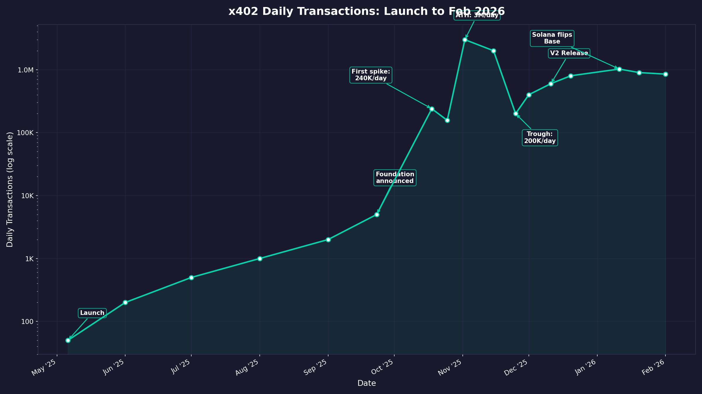
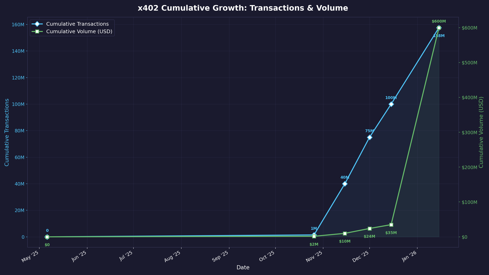
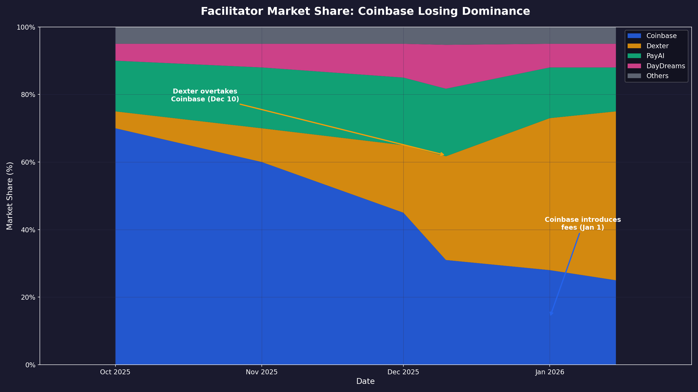
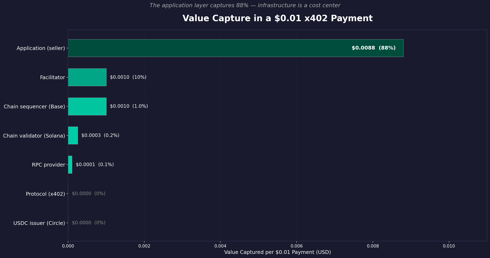
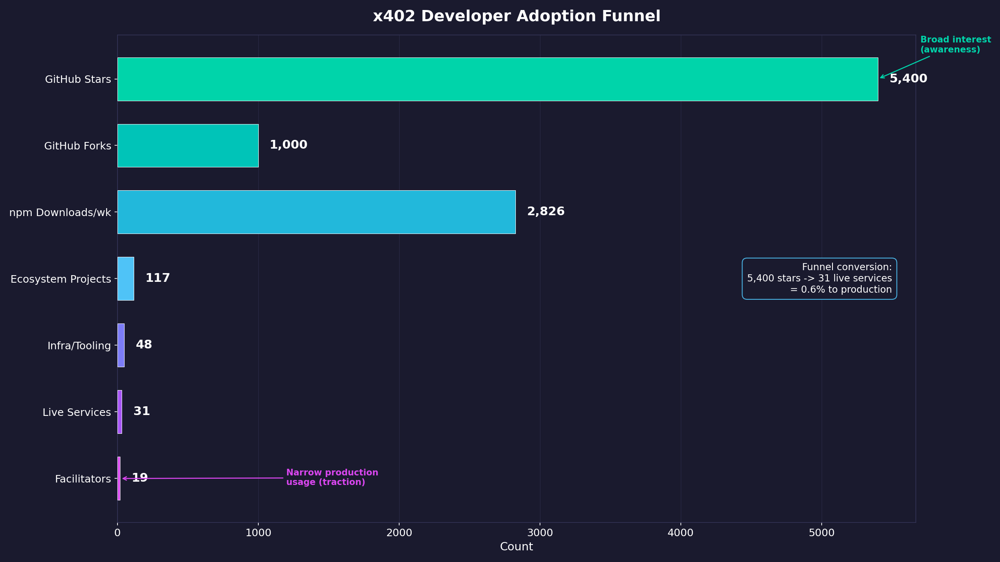
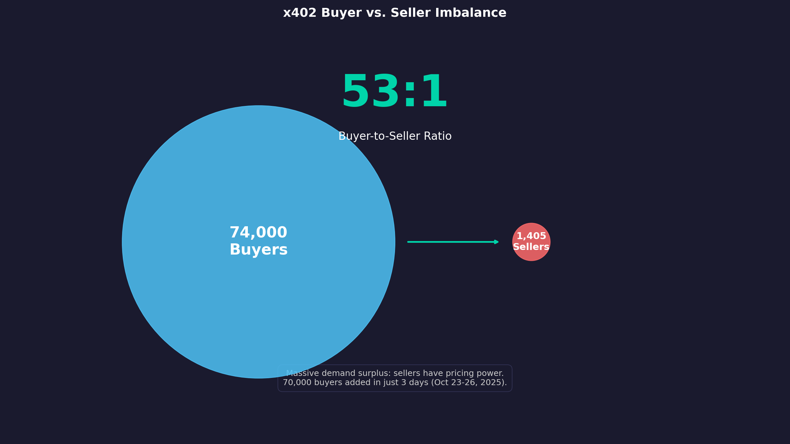
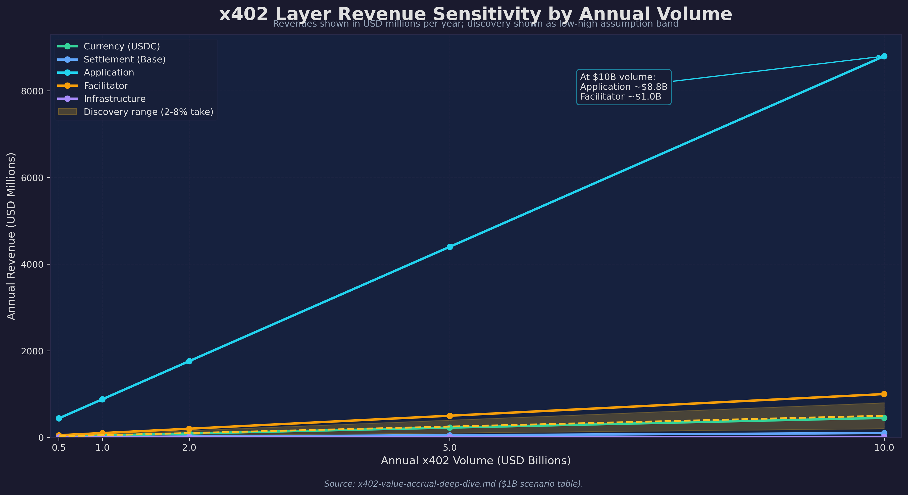
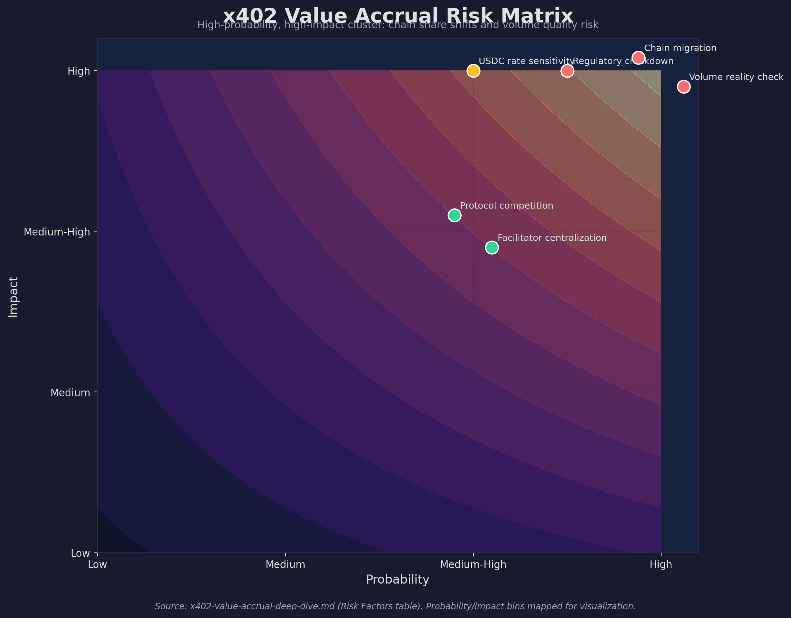

# x402 Value Capture Analysis: Where the Money Will Be

**Date:** February 9, 2026
**Type:** First-principles analysis with raw data

## Memo Navigation

- Start Here: [Top-Level Takeaways](00-top-level-takeaways.md)
- Full Hierarchy: [Memo Index](README.md)
- Decision Layer: [IC Memo](investment-committee-memo-agent-fintech-infrastructure-2026-02-09.md), [Top 15 Opportunities](investment-opportunities.md)
- Related: [x402 Research Memo](x402-research-memo.md), [x402 Value Accrual Deep Dive](../x402-value-accrual-deep-dive.md)

---

## Executive Summary

x402 is an open protocol with zero protocol-level fees. This means value capture is entirely a function of which **layers above the protocol** can sustain pricing power. After analyzing raw adoption data, mapping the full value chain, and studying 9 historical analogies, we identify **three layers with durable value capture potential** and **three that will commoditize**. The single most important insight: **Coinbase has architected a vertical stack where they capture value at 4+ layers simultaneously** — facilitator, chain sequencer, wallet, and USDC float — making them the primary beneficiary regardless of which layer "wins."

---

## Part I: Raw Adoption Data

### Transaction Growth Trajectory

| Date | Daily Tx | Cumulative Tx | Cumulative Volume |
|------|----------|---------------|-------------------|
| Pre-Oct 2025 | Hundreds-thousands | — | — |
| Oct 18, 2025 | 239,505 | 1.4M | ~$1.6M |
| Nov 2-3, 2025 | ~3,000,000 (ATH) | ~40M | — |
| Late Nov 2025 | ~200,000 (trough) | — | — |
| Dec 2025 | 600,000+ | 75M-100M | $24M |
| Jan 11, 2026 | ~1,023,400 | ~157M | — |
| Late Jan 2026 | — | 157.6M | $600M+ (annualized) |

**Key observation:** The protocol went from hundreds of daily transactions to 3M/day in ~6 months, crashed 93%, then stabilized at 600K-1M/day. This is a classic adoption S-curve with a speculative overshoot, not a collapse.

### Chain Split

| Chain | Cumulative Tx | Share | Trend |
|-------|---------------|-------|-------|
| Base | 119M | ~75% | Declining share |
| Solana | 38.6M | ~25% | Growing (flipped Base daily on Jan 11) |
| Others (Polygon, Avalanche, BNB, Sei) | Minimal | <1% | Early |

**Key observation:** Base dominance is eroding. Solana is closing the gap on cheaper gas ($0.00025 vs $0.001). Multi-chain fragmentation is beginning but hasn't meaningfully arrived yet.

### Facilitator Market Share

| Facilitator | Cumulative Tx | Daily Share (Jan 2026) | Fee Model |
|-------------|---------------|------------------------|-----------|
| Coinbase CDP | 10M+ | ~25-33% | $0.001/tx after 1K free/mo |
| Dexter | 10M+ | ~50% | Not disclosed |
| PayAI | 10M+ | ~15% | Gas-free; optional 1% buyer fee |
| DayDreams | 10M+ | ~10% | Not disclosed |
| 15+ others | Various | <5% combined | Various |

**Key observation:** The facilitator layer is already fragmenting. Coinbase lost majority share within 7 months of launch. Dexter overtook them by mid-December 2025. This suggests **facilitator switching costs are low** — a critical signal for value capture analysis.

### Developer Adoption

| Metric | Value |
|--------|-------|
| GitHub stars | 5,400 |
| GitHub forks | 1,000 |
| npm weekly downloads (@coinbase/x402) | 2,826 |
| Dependent npm projects | 19 |
| Total ecosystem projects | 117+ |
| Hackathon submissions | 600+ across events |
| Live services/endpoints | 31 |
| Facilitators | 19 |

**Key observation:** Developer adoption is real but narrow. 2,826 weekly npm downloads and 19 dependent projects is small compared to mature protocols. For comparison, Express.js has 30M+ weekly downloads. The 117 ecosystem projects vs 31 live services suggests a ~73% dropout rate from project to production.

### User Metrics

| Metric | Value | Date |
|--------|-------|------|
| Unique buyers | ~74,000 | Oct 26, 2025 |
| Unique sellers | ~1,405 | Oct 26, 2025 |
| Buyer:seller ratio | 53:1 | — |
| Average payment size | $0.60-$1.00 | — |
| 90-day buyer growth | +279.6% | Late Oct 2025 |

**Key observation:** The 53:1 buyer-to-seller ratio reveals an extreme supply-side bottleneck. There are far more agents/clients willing to pay than services accepting payment. This is the classic two-sided marketplace bootstrapping problem — and it tells us where the power currently sits (with sellers/services).

---

## Part II: Value Chain Map

### Anatomy of a $0.01 x402 Payment

```
┌─────────────┐     ┌──────────────┐     ┌─────────────┐     ┌──────────────┐
│   Client     │────>│  Resource     │────>│ Facilitator  │────>│  Blockchain  │
│   Wallet     │<────│  Server      │<────│              │<────│  (Base/Sol)  │
└─────────────┘     └──────────────┘     └─────────────┘     └──────────────┘
  Wallet fee:          App margin:         Facilitator fee:     Chain fee:
  $0.01/sig           ~$0.0088             $0.001               $0.001
  (Privy) or          (88%)                (10%)                (1%)
  $0 (Coinbase)
```

### Who Captures What

| Layer | Actor(s) | Revenue per $0.01 Tx | Revenue Model | Margin |
|-------|----------|---------------------|---------------|--------|
| **Protocol** | x402 Foundation | $0.000 | None (open standard) | N/A |
| **Facilitator** | Coinbase, Dexter, PayAI, 16+ others | $0.001 | Per-tx fee | 50-75% (after gas) |
| **Chain/Sequencer** | Base (Coinbase), Solana validators | $0.001 (Base) / $0.00025 (Sol) | Execution fees | >90% |
| **Application** | Firecrawl, DappLooker, etc. | ~$0.0088 | Pricing discretion | 70-90% |
| **Wallet/Identity** | Privy, Dynamic, Coinbase MPC | $0.01/sig (Privy) or $0 | Per-signature or bundled | High |
| **Stablecoin Issuer** | Circle (USDC) | Float yield (~5% APY on reserves) | Treasury yield | ~95% |
| **RPC/Infra** | QuickNode, Alchemy | Fractional | Subscription/usage | 60-70% |
| **Compliance** | UQPAY, Sardine-class vendors, FIS KYA stack | ~$0.00002-$0.00010 (0.2-1.0%) | Enterprise SaaS + per-tx screening | 70-80% |
| **Discovery** | Fluora, x402 Bazaar, new entrants | ~$0.0002-$0.0008 (2-8% blended) | Marketplace take rate + promoted ranking | 60-80% at scale |

*Assumption basis for emerging layers: compliance modeled at 20-100 bps effective take rate; discovery modeled at 2-8% blended take rate once routing consolidates.*

---

## Part III: Historical Analogies

### The Pattern That Repeats

Every open protocol follows the same value capture arc:

| Phase | What Happens | x402 Stage |
|-------|-------------|------------|
| 1. Protocol launch | Free, open, no fees | **Current** |
| 2. Infrastructure buildout | Multiple providers compete on reliability | **Current** |
| 3. Commoditization of base layer | Basic functionality becomes free/near-free | **Beginning** (Dexter overtaking Coinbase) |
| 4. Value migrates to differentiation | Compliance, analytics, enterprise features command premium | **Not yet** |
| 5. Consolidation | 2-3 players dominate with bundled offerings | **Not yet** |

### Concrete Analogy Data

| Analogy | Protocol Revenue | Infrastructure Revenue | Key Takeaway |
|---------|-----------------|----------------------|--------------|
| HTTP → AWS/Cloudflare | $0 | $110B+/yr | Infrastructure providers capture all value |
| SMTP → Mailchimp/SendGrid | $0 | $1B+ at acquisition | "Deliverability" layer wins |
| Card networks → Stripe | Visa ~15bps | Stripe ~40bps net | Facilitator captures 2.5x the network |
| DNS → Verisign/GoDaddy | $0 | $6.3B/yr combined | Customer relationship > registry |
| SSL → Let's Encrypt | $0 | $209M/yr (destroyed from $1B+) | **Open-source kills paid infrastructure** |
| Lightning/L402 | $0 | Near-zero | **Cautionary: too-cheap infra = no value capture anywhere** |

### The Two Risk Scenarios

**Risk 1 — The "Let's Encrypt" scenario:** An open-source facilitator makes basic payment verification free. The $0.001/tx facilitator fee goes to zero. The entire facilitator layer commoditizes. Value capture shifts entirely to the application layer and the chain layer.

**Risk 2 — The "Lightning" scenario:** The protocol makes payments so cheap and easy that no layer can charge meaningful fees. Total value captured across the entire stack approaches zero. The protocol succeeds technically but fails commercially for everyone except the underlying chain.

---

## Part IV: First-Principles Value Capture Analysis

### Framework: Seven Forces That Determine Value Capture

For each layer of the x402 stack, we evaluate:

1. **Switching costs** — How hard is it to move to a competitor?
2. **Network effects** — Does the product get better with more users?
3. **Commoditization pressure** — Can the offering be replicated cheaply?
4. **Regulatory moats** — Does compliance create barriers to entry?
5. **Data advantages** — Does usage create proprietary, compounding data?
6. **Bottleneck control** — Does this layer control a scarce resource?
7. **Power law dynamics** — Will volume concentrate or distribute?

---

### Layer 1: Protocol (x402 Foundation)

| Force | Assessment |
|-------|-----------|
| Switching costs | Zero — it's an open spec |
| Network effects | Strong indirect — more adopters make the standard more valuable |
| Commoditization | N/A — it's already free |
| Regulatory moat | None |
| Data advantage | None |
| Bottleneck control | Spec governance (soft power only) |
| Power law | Winner-take-all for the standard itself |

**Value capture: $0.** By design. The Foundation captures influence, not revenue. This is correct strategy — charging for the protocol would invite forking and slow adoption. The value of controlling the standard is **optionality** and **ecosystem positioning**, not direct revenue.

**Verdict: Zero direct value, high strategic value for Foundation members (Coinbase, Cloudflare).**

---

### Layer 2: Facilitator (Coinbase CDP, Dexter, PayAI, etc.)

| Force | Assessment |
|-------|-----------|
| Switching costs | **Low.** Facilitator URL is a config parameter. Switching takes one line of code. Data confirms this: Dexter overtook Coinbase in <7 months. |
| Network effects | **Weak.** Facilitators don't get meaningfully better with more users. Some data advantages (fraud patterns) but minimal. |
| Commoditization | **High.** The facilitator's core job — verify a signature and submit a tx — is algorithmic and open-source. Anyone can run one. 19 facilitators already exist. |
| Regulatory moat | **Emerging.** KYC/AML requirements could create barriers. UQPAY is first mover here. |
| Data advantage | **Moderate.** High-volume facilitators see payment patterns, can detect fraud. But data is mostly on-chain and public. |
| Bottleneck control | **None.** The spec explicitly allows anyone to be a facilitator. |
| Power law | **Moderate.** Currently 4 facilitators with 10M+ tx. Trending toward oligopoly but not monopoly. |

**Value capture thesis:** Facilitators are in the **"Stripe position"** today — capturing ~10% of each transaction ($0.001 on a $0.01 payment). But unlike Stripe, facilitator switching costs are near-zero. Stripe's moat is (a) developer ecosystem lock-in, (b) years of compliance infrastructure, (c) proprietary fraud data from $1T+ in volume. x402 facilitators have none of these yet.

**The math at scale:**

| Scenario | Annual Volume | Facilitator Revenue at $0.001/tx | Margin (est.) |
|----------|--------------|----------------------------------|---------------|
| Current (2026) | ~500M tx/yr | $500K | $250-375K |
| 5x growth | 2.5B tx/yr | $2.5M | $1.25-1.88M |
| 50x growth | 25B tx/yr | $25M | $12.5-18.8M |
| 500x growth (Stripe-scale) | 250B tx/yr | $250M | $125-188M |

At current volumes, facilitator revenue is trivially small. Even at 500x growth, it's a $250M revenue pool split among 4+ competitors — a mid-sized business, not a platform-defining one.

**Verdict: Moderate value capture today, high commoditization risk. Sustainable only if facilitators layer compliance, analytics, and enterprise features on top of basic settlement. The "Let's Encrypt" risk is real.**

---

### Layer 3: Blockchain / Chain Sequencer (Base, Solana)

| Force | Assessment |
|-------|-----------|
| Switching costs | **Moderate.** Switching chains requires changing wallet infra, SDK config, and potentially stablecoin bridging. Not trivial but not prohibitive. |
| Network effects | **Strong.** More users = more liquidity = more services = more users. Classic cross-side network effects. |
| Commoditization | **Low-moderate.** Building an L2 is hard. But there are 50+ EVM L2s. Differentiation is liquidity and ecosystem, not technology. |
| Regulatory moat | **Low.** Chains themselves face regulatory scrutiny (sequencer centralization). |
| Data advantage | **Low.** All chain data is public. |
| Bottleneck control | **High.** The chain is the ultimate settlement layer. Every x402 tx must pay chain fees. |
| Power law | **Strong.** Base has 75% of x402 tx. Liquidity begets liquidity. |

**Value capture thesis:** The chain layer is a **mandatory toll booth**. Every x402 transaction pays gas regardless of which facilitator or app is involved. Base's sequencer earns ~$0.001/tx with >90% margins. At 119M cumulative transactions, that's ~$119K in direct sequencer revenue from x402 alone — small today but growing.

**The Coinbase double-dip:** Coinbase operates Base's sequencer. They earn sequencer fees on every x402 transaction on Base (~$0.001/tx) AND facilitator fees on transactions using their facilitator (~$0.001/tx). On a $0.01 payment facilitated by Coinbase on Base, Coinbase captures ~20% ($0.002) across both layers.

**Base sequencer revenue (all activity, not just x402):** $75.4M YTD 2025, $26.4M in Q4 2024 alone, with $24.2M profit. x402 drove 19% of Base's daily transactions at peak — implying x402 contributed ~$5-14M in annualized sequencer revenue during peak periods.

**Verdict: Strong value capture with durable positioning. The chain is the one layer that cannot be bypassed or commoditized away. But x402 is chain-agnostic by design, so Base must compete on cost, speed, and ecosystem to retain share.**

---

### Layer 4: Application / Service Provider (Firecrawl, DappLooker, etc.)

| Force | Assessment |
|-------|-----------|
| Switching costs | **Moderate-high.** Switching to a different data/API provider requires integration work and may mean different data quality. |
| Network effects | **Varies.** Some apps have data network effects (more queries = better models). Most don't. |
| Commoditization | **Low for differentiated services.** A proprietary dataset or AI model can't be replicated. Generic APIs (weather, exchange rates) will commoditize. |
| Regulatory moat | **Low.** |
| Data advantage | **High for some.** Proprietary data services have intrinsic moats. |
| Bottleneck control | **High for unique services.** If there's only one provider of a specific dataset, they have pricing power. |
| Power law | **Moderate.** Long-tail distribution — a few popular services and many niche ones. |

**Value capture thesis:** The application layer captures **~88% of each payment** ($0.0088 of a $0.01 transaction). This is by far the largest share. And unlike facilitators, applications have real switching costs — an agent configured to use Firecrawl for web scraping can't trivially switch to a different scraping service with different APIs, different data quality, and different pricing.

**The "fat application" argument:** In the x402 stack, the application layer resembles Web2 more than crypto. Apps with proprietary data, unique capabilities, or strong developer ecosystems will capture the lion's share of economic value. The protocol and infrastructure layers are cost centers, not profit centers.

**Key data point:** The 53:1 buyer-to-seller ratio means sellers (apps/services) have immense pricing power today. There is far more demand from agents than supply of x402-enabled services. This imbalance will persist until the ecosystem matures.

**Verdict: Strongest value capture layer for differentiated services. The app layer is where most of the money will be, but only for services with proprietary data or capabilities. Generic services will face price competition.**

---

### Layer 5: Wallet / Identity (Privy, Coinbase MPC, Dynamic)

| Force | Assessment |
|-------|-----------|
| Switching costs | **High.** Agent wallets hold funds, have on-chain history, and are embedded in agent architectures. Migrating a wallet is non-trivial. |
| Network effects | **Moderate.** More dApps supporting a wallet = more valuable. |
| Commoditization | **Moderate.** MPC wallet tech is becoming standard. But UX and security differentiation matters. |
| Regulatory moat | **Growing.** Wallet providers may need money transmitter licenses as agent volumes scale. |
| Data advantage | **High.** Wallet providers see every transaction their users make — spending patterns, service preferences, budgets. |
| Bottleneck control | **Moderate.** Agents need a wallet. But there are multiple options. |
| Power law | **Strong.** Coinbase MPC wallets dominate because they're bundled free with the facilitator. |

**Value capture thesis:** Wallets are the **sleeper value capture layer**. Privy charges $0.01/signature after the free tier — meaning for a high-frequency agent making 100K x402 payments/month, Privy earns $500/month from wallet signing alone. This can exceed what the facilitator earns.

More importantly, **wallet providers own the customer relationship**. The DNS analogy applies: GoDaddy ($4.6B revenue) captures 3x Verisign ($1.66B) because they own the customer and upsell. The wallet provider that owns the agent relationship can upsell analytics, budgeting, compliance, and service discovery.

**Coinbase's bundling advantage:** Coinbase MPC wallets are free because Coinbase monetizes via facilitator fees and Base sequencer fees. This is the classic "give away the razor, sell the blades" model. Competitors like Privy must charge for wallets because they don't own a facilitator or chain.

**Verdict: High value capture potential, especially as the agent economy scales. The wallet is the closest layer to the "customer" (the agent/developer). Whoever controls the agent's wallet controls the relationship.**

---

### Layer 6: Stablecoin Issuer (Circle / USDC)

| Force | Assessment |
|-------|-----------|
| Switching costs | **Very high.** USDC is embedded in the protocol spec (ERC-3009 dependency). Switching stablecoins requires protocol-level changes. |
| Network effects | **Extremely strong.** More USDC acceptance = more USDC usage = more acceptance. |
| Commoditization | **Very low.** Few stablecoins have ERC-3009 support. Regulatory barriers to issuing stablecoins are enormous. |
| Regulatory moat | **Massive.** Stablecoin issuance requires banking relationships, reserves, audits, and (increasingly) licenses. |
| Data advantage | **Moderate.** Circle sees aggregate flow data. |
| Bottleneck control | **Very high.** x402 V1 literally cannot function without ERC-3009, which currently means USDC. |
| Power law | **Winner-take-most.** USDC has ~98.7% share of x402 payment value. |

**Value capture thesis:** Circle is the **invisible monopolist** of the x402 stack. They don't charge per-transaction fees — instead, they earn ~5% APY on the USDC reserves (invested in Treasury bills). Every dollar of USDC sitting in agent wallets, facilitator escrows, and seller accounts earns Circle money.

**The math:** If the x402 economy reaches $10B in annual volume with an average USDC float of $500M across wallets and escrows, Circle earns ~$25M/year from that float alone. At $100B in volume, the float could be $5B, generating $250M/year. This scales linearly with the size of the x402 economy, costs Circle essentially nothing to service, and cannot be competed away as long as USDC dominates.

**The V1 lock-in:** x402 V1's dependency on ERC-3009 (which only USDC supports) gave Circle a structural monopoly. V2 is broadening asset support, but USDC's 98.7% share will be sticky due to liquidity network effects.

**Verdict: Highest margin, most durable value capture in the entire stack. Circle earns money from the existence of USDC balances, not from transaction flow. This is the equivalent of a central bank's seigniorage — an invisible, scalable, defensible revenue stream.**

---

### Layer 7: Compliance (UQPAY, future entrants)

| Force | Assessment |
|-------|-----------|
| Switching costs | **High.** Compliance integration is deep and audit-dependent. |
| Network effects | **Moderate.** More merchants using a compliance provider = better fraud data. |
| Commoditization | **Low.** Regulatory requirements are jurisdiction-specific and complex. |
| Regulatory moat | **Very high.** This layer IS the regulatory moat. |
| Data advantage | **High.** Transaction monitoring data is proprietary and compounds. |
| Bottleneck control | **Will become mandatory.** As volumes scale, regulators will require KYC/AML for x402 transactions. |
| Power law | **Strong.** Compliance is winner-take-most due to trust and audit requirements. |

**Value capture thesis:** Compliance is the **most undervalued layer** today. UQPAY just launched (Feb 8, 2026). There is essentially no competition. As x402 volumes grow and regulators notice (and they will — autonomous AI agents moving hundreds of millions in stablecoins without KYC will attract attention), compliance will become a **mandatory chokepoint**.

The SSL/TLS analogy inverts here: Let's Encrypt destroyed paid CAs because certificates were a commodity. But compliance is NOT a commodity — it's jurisdiction-specific, requires legal expertise, and creates real switching costs (audit history, regulatory relationships). The compliance layer is **structurally resistant to commoditization**.

**Verdict: Early-stage but potentially the highest-margin layer as the ecosystem matures. First movers with regulatory relationships will build durable moats. This is the "picks and shovels" play of the x402 stack.**

---

### Layer 8: Discovery / Marketplace (Fluora, x402 Bazaar)

| Force | Assessment |
|-------|-----------|
| Switching costs | **Moderate.** If agents discover services through a marketplace, switching requires reconfiguring discovery. |
| Network effects | **Very strong.** More services listed = more agents use it = more services list. Classic marketplace dynamics. |
| Commoditization | **Moderate.** Basic indexing is easy. Curation, quality scoring, and reputation are hard. |
| Regulatory moat | **Low.** |
| Data advantage | **Very high.** The marketplace sees all search queries — what agents want but can't find. This is the most valuable signal in the ecosystem. |
| Bottleneck control | **Potentially high.** If one marketplace becomes the default discovery layer, it controls agent-to-service routing. |
| Power law | **Winner-take-all.** Marketplaces are the strongest network-effect business. Google won search. One x402 marketplace will likely dominate. |

**Value capture thesis:** The discovery layer is **the biggest open opportunity** in the x402 stack. Today, x402 Bazaar is a free, open directory. Fluora is early. There is no dominant "Google of x402 APIs." Whoever builds the marketplace that agents default to for finding and evaluating x402-enabled services will capture enormous value through:

1. **Routing fees** (taking a cut of each transaction they facilitate)
2. **Data monetization** (knowing what agents search for before services exist)
3. **Quality/reputation systems** (becoming the trust layer)
4. **Promoted listings** (advertising revenue from services wanting visibility)

The search query data alone — "what are agents trying to buy that nobody sells yet?" — is extraordinarily valuable market intelligence.

**Verdict: Biggest greenfield opportunity. Winner-take-all dynamics. The marketplace that becomes the default agent discovery layer could be the most valuable company in the x402 ecosystem.**

---

## Part V: Synthesis — Where Value Accrues

### Value Capture Ranking (by durability and scale potential)

| Rank | Layer | Current Rev | Durability | Scale Potential | Key Risk |
|------|-------|-------------|------------|----------------|----------|
| 1 | **Stablecoin Issuer (Circle)** | Float yield | Very high | Scales with total USDC supply | USDC loses share to USDT/others |
| 2 | **Application Layer** | 88% of payment | High (for differentiated) | Scales with agent economy | Commoditization of generic services |
| 3 | **Discovery/Marketplace** | ~$0 today | Very high once established | Winner-take-all | Hasn't been built yet |
| 4 | **Compliance** | ~$0 today | Very high | Mandatory as regulation arrives | Regulation timeline uncertain |
| 5 | **Chain/Sequencer (Base)** | ~$0.001/tx | High | Scales with tx count | Multi-chain fragmentation |
| 6 | **Wallet/Identity** | $0-0.01/sig | Moderate-high | Owns agent relationship | Coinbase bundling squeezes margins |
| 7 | **Facilitator** | $0.001/tx | Low-moderate | Commoditizing already | "Let's Encrypt" scenario |
| 8 | **Protocol** | $0 | N/A | Strategic only | N/A |

### The Coinbase Thesis

Coinbase is the most interesting entity in the x402 ecosystem because they capture value at **every layer simultaneously**:

| Layer | Coinbase's Position | Revenue Mechanism |
|-------|--------------------|-------------------|
| Protocol | Co-founded Foundation | Strategic influence |
| Facilitator | Coinbase CDP (~25-33% share) | $0.001/tx |
| Chain | Operates Base sequencer | ~$0.001/tx (>90% margin) |
| Wallet | Coinbase MPC wallets (free) | Drives facilitator/chain usage |
| Stablecoin | Strategic partner with Circle | USDC ecosystem growth |
| Exchange | Lists USDC, Base tokens | Trading fees |

**On a single $0.01 x402 payment on Base via Coinbase facilitator, Coinbase earns ~$0.002 directly (20% of payment value) and benefits from USDC ecosystem growth indirectly.** No other entity touches more than one layer.

This vertical integration is Coinbase's true strategic moat. Even if the facilitator layer commoditizes (which is happening — Dexter already overtook them), Coinbase still earns from Base sequencer fees, still benefits from wallet lock-in, and still gains from USDC adoption.

**The strategic implication:** x402 is not primarily a revenue product for Coinbase. It's a **demand driver for Base and USDC** — their two highest-margin businesses. The protocol is a funnel: more x402 adoption → more transactions on Base → more USDC in circulation → more sequencer revenue + more Circle float yield (which benefits Coinbase through its Circle relationship and USDC custody).

### The Three Investable Theses

**Thesis 1: "Build the marketplace" (Discovery layer)**
- Winner-take-all opportunity
- No dominant player exists
- Whoever becomes the default agent discovery mechanism captures routing fees + data
- Analogous to early Google (organize the world's x402 APIs)
- Risk: the x402 ecosystem may stay too small to support a standalone marketplace business

**Thesis 2: "Be the compliance layer" (UQPAY model)**
- Regulatory moats create durable pricing power
- Only one entrant (UQPAY, launched yesterday)
- As volumes scale, compliance becomes mandatory — this is a "when not if" opportunity
- Analogous to early Stripe Atlas / compliance infrastructure
- Risk: regulation could kill x402 entirely rather than creating a compliance opportunity

**Thesis 3: "Build differentiated applications" (Service layer)**
- 88% of payment value goes to the seller
- 53:1 buyer-to-seller ratio = massive seller pricing power today
- Proprietary data services have the strongest moats
- This is the "build a business on x402" thesis rather than "invest in x402 infrastructure"
- Risk: requires a real product, not just x402 integration

### What Will NOT Work

**Building a standalone facilitator business.** The data is clear: facilitator switching costs are near-zero (Dexter overtook Coinbase in months), margins are thin ($0.001/tx), and the "Let's Encrypt" risk is real. A facilitator-only business is a race to the bottom. The only sustainable facilitator businesses will be those that bundle compliance, analytics, and enterprise features — essentially becoming "Stripe for x402" rather than "commodity payment router."

**Building on protocol-level fees.** The protocol is free and will stay free. Any attempt to introduce protocol fees would invite forking. The x402 Foundation's value is influence, not revenue.

---

## Part VI: Market Structure Predictions

### Short-term (2026)

- Facilitator layer continues fragmenting: 5-8 facilitators with meaningful share
- Solana overtakes Base in daily x402 volume (cheaper gas drives migration)
- First regulatory inquiry into autonomous agent payments triggers compliance demand
- 2-3 compliance startups emerge
- Discovery remains fragmented and underdeveloped

### Medium-term (2027-2028)

- Facilitator consolidation begins: 2-3 dominant players emerge, offering compliance + analytics bundles
- One discovery marketplace achieves dominance (the "Google of agent APIs")
- USDC share drops below 90% as V2 enables multi-asset payments — but USDC remains dominant
- Base and Solana solidify as the two primary x402 chains
- Regulatory frameworks emerge in US and EU specifically addressing agent payments
- Coinbase's vertical integration either proves decisive (they dominate) or triggers antitrust scrutiny

### Long-term (2029+)

- x402 becomes the default standard for machine-to-machine payments (analogous to HTTPS for security)
- The protocol layer remains free; value concentrates in: applications, compliance, discovery
- Total x402 volume reaches $100B+/year if agent economy forecasts are correct
- Circle's USDC float yield from x402-adjacent balances alone generates $100M+/year
- The "fat application" thesis proves correct: the most valuable x402 companies are service providers, not infrastructure

---

## Part VII: What the Charts Reveal

Eight visualizations of x402 adoption data surface patterns that tables alone obscure. Charts are in `charts/x402/`.

### Chart 1: Daily Tx Trajectory — Classic speculative overshoot, not collapse
The log-scale chart tells the real story: x402 grew steadily from 50 tx/day to ~5K over 5 months of quiet adoption, then exploded 600x in 3 weeks to a 3M/day ATH. The 93% crash to 200K looks catastrophic on a linear scale, but on log scale it stabilized at 600K-1M/day — still **4 orders of magnitude above launch**. The protocol found a sustainable floor after the hype dissipated.



### Chart 2: Cumulative Growth — The volume spike is suspicious
Transactions grew steadily (0 → 75M → 158M), but cumulative volume jumped from $35M to $600M in a single month (Dec 2025 → Jan 2026). That's a 17x volume increase while tx count only doubled. Either average payment sizes spiked dramatically or the $600M figure includes speculative/wash activity. Worth scrutinizing.



### Chart 3: Chain Split — Solana is eating Base's lunch
Base went from 97% to 75% of cumulative transactions in just 3 months, and Solana already flipped Base on daily volume (Jan 11). The driver is simple economics: Solana gas is 4x cheaper ($0.00025 vs $0.001). This undermines Coinbase's vertical integration thesis — if volume migrates to Solana, Coinbase loses the sequencer revenue layer.


### Chart 4: Facilitator Share — Zero switching costs confirmed visually
This is the most important chart for the value capture thesis. Coinbase went from 70% to 25% in 3.5 months. Dexter came from nowhere to 50%. This is empirical proof that **facilitator switching costs are near-zero** — the layer is commoditizing in real time. Building a standalone facilitator business is a losing game.



### Chart 5: Value Chain — Infrastructure is a rounding error
The waterfall makes the economics visceral: the application (seller) captures 88 cents of every dollar. The facilitator gets 10 cents. Everything else is less than 2 cents combined. The protocol itself captures literally zero. If you're building in x402, **build the application, not the infrastructure**.



### Chart 6: Ecosystem Token Mcap — Speculation, not fundamentals
$100M → $12B in 2 weeks is pure memecoin mania, not protocol adoption. The recovery to $10.5B still has no fundamental support — the entire protocol has only processed $600M in volume with zero protocol fees. This chart is a warning about conflating token speculation with real traction.


### Chart 7: Developer Funnel — 0.6% conversion to production
5,400 GitHub stars but only 31 live services. That's a 0.6% stars-to-production conversion rate. The funnel narrows dramatically: 117 ecosystem projects → 48 infra/tooling → 31 live services → 19 facilitators. **The supply side (services accepting x402) is the bottleneck**, not demand or developer interest.



### Chart 8: Buyer/Seller Ratio — The supply-side opportunity
The proportional circles make it impossible to miss: 74,000 buyers dwarfing 1,405 sellers. This 53:1 ratio is the single most actionable data point in the entire set. It means: **(a)** sellers have extreme pricing power today, **(b)** the biggest opportunity is building services that accept x402, not building infrastructure, and **(c)** the ecosystem won't grow until the supply side catches up.



### The Meta-Takeaway

Across all 8 charts, one conclusion dominates: **x402 has real adoption (158M tx, 850K/day steady state) but the value capture story heavily favors the application layer and disfavors infrastructure.** Facilitators are commoditizing, chains are competing on cost, and the protocol captures nothing. The money is in being a seller in a market starved for sellers.

### Supplemental Scenario Charts






---

## Appendix: Key Data Sources

- Dune Analytics (hashed_official dashboard) — on-chain transaction data
- PANews, CoinTribune, Cryptonomist — transaction metrics and chain splits
- x402.org — ecosystem project listings, V2 specification
- Coinbase Developer Documentation — facilitator pricing
- CoinGecko — ecosystem token market caps
- GitHub (coinbase/x402) — developer adoption metrics
- npm registry — package download data
- LongHash Ventures — agentic commerce market sizing
- DWF Labs — protocol architecture research
- Cloudflare Blog — Foundation announcement and integration details
- Stacy Muur / Dune — peak transaction analysis
- ainvest — cumulative volume reporting

---

*This analysis is based on publicly available data as of February 9, 2026. All projections are the author's estimates based on historical analogies and first-principles reasoning, not financial advice.*
